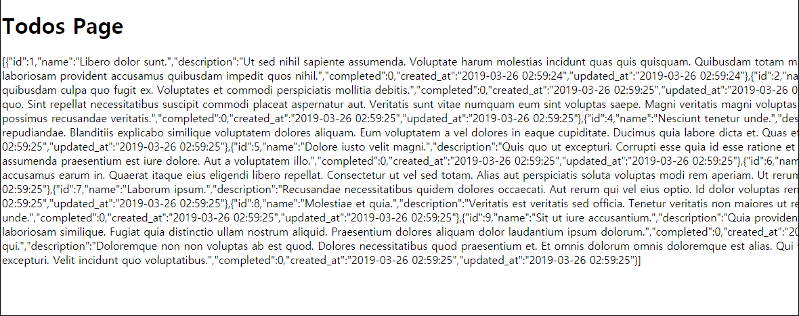
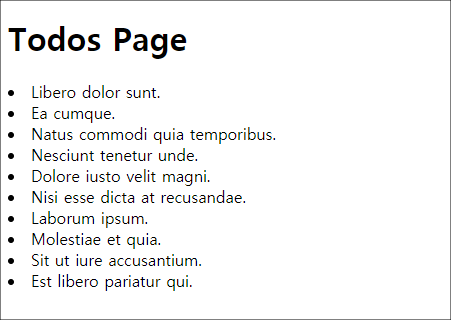

## Model View Controller


이제 데이터베이스의 todos 테이블에 있는 데이터를 todos 페이지에 나타내려고 한다.  

``app/Http/Controllers/TodosController.php`` 파일이 바로 todos.index view를
주관한다는 것을 기억하라.  

우리는 이 TodosController의 index 메소드에서 '데이터베이스에서 데이터를
가져오기', 그리고 'index page에 표시하기' 이렇게 2가지 작업을 할 수 있다.  

### 데이터베이스에서 데이터 가져오기  

Model은 데이터베이스의 todos 테이블과 커뮤니케이팅을 담당한다.  
그러므로 우리는 이 모델을 사용하면 된다.  

```php
// app/Http/Controllers/TodosController.php

...
use App\Todo;
use Illuminate\Http\Request;

...
    public function index()
    {
 
      // Todos 테이블의 모든 레코드를 가져온다. 
      $todos = Todo::all(); 
      
      // view에 이것을 적용하기 위해서 with 함수 호출
      return view('todos.index')->with('todos', $todos);
    }
}
```
with 함수의 첫번째 인자는 우리의 view에 전달할 'key 이름'이고, 두번째 인자는
view에 전달할 데이터이다.  

### view page에서 확인  

```php
// resources/views/todos/index.blade.php
...

    <h1>Todos Page</h1>

    {{ $todos }}
...
```
이렇게 하면 todos 테이블의 내용이 전부 불러와진 것을 확인할 수 있다.  



``{{ $todos }}``의 $todos는 with의 첫번째 인자인 'key 이름'에 해당한다. 두번째 인자가 아님.

이를 확인하기 위해 with의 인자를 다음과 같이 수정해본다.  

```php
// app/Http/Controllers/TodosController.php

...
    public function index()
    {
      return view('todos.index')->with('tasks', Todo::all());
    }
}
```
```php
// resources/views/todos/index.blade.php
...

    <h1>Todos Page</h1>

    {{ $tasks }}
...
```
이렇게 하면 todos로 작성했을때와 같은 결과를 확인할 수 있다.  
또한 with 함수의 두번째 인자로 원래 ``$todos``가 ``Todo::all()``로 대체된 것도
알 수 있다.  


### view page 수정  

데이터를 불러오긴 했지만 우리가 원하는 형식은 아니다. 이것을 수정해보자.  

```php
// resources/views/todos/index.blade.php
...

    <h1>Todos Page</h1>
  
    // 이런 방식을 blade directive 라고 부른다. 
    @foreach($todos as $todo) 
      
    @endforeach
...
```
그리고 foreach 안에서 다음과 같이 할 수 있다.  

```php
// resources/views/todos/index.blade.php
...
    @foreach($todos as $todo) 
        <li> {{ $todo->name }} </li>      
    @endforeach
...
```



### 정리  

1. ``routes/web.php`` 파일을 보자. 사용자가 todos 페이지에 접근하면
   TodosController의 index 메소드가 실행된다. 
2. TodosController파일에 index 메소드를 보면, 이 메소드는 view를 반환하고 있는데, 
   with 함수로 어떤 데이터를 같이 반환하고 있다. 그 데이터의 이름은 'todos'이고,
   그 값은 'Todo::all()'이다. 이때 'Todo'는 모델이름이고, 'all()'함수는 static
   함수로 데이터베이스 테이블, 즉 "Todo 모델이 컨트롤하는 테이블인 'todos' 테이블"에서 모든 데이터를 가져오는 함수이다. 
3. 여기에서 반환하는 'todos.index' view는 todos 디렉토리 안의
   ``index.blade.php``파일이고, 그 안에서 ``@foreach``로 todos 테이블의 데이터
   중에 name 데이터들을 list 태그를 통해 가져오고 있다.  

