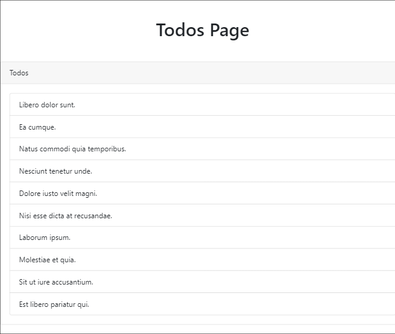
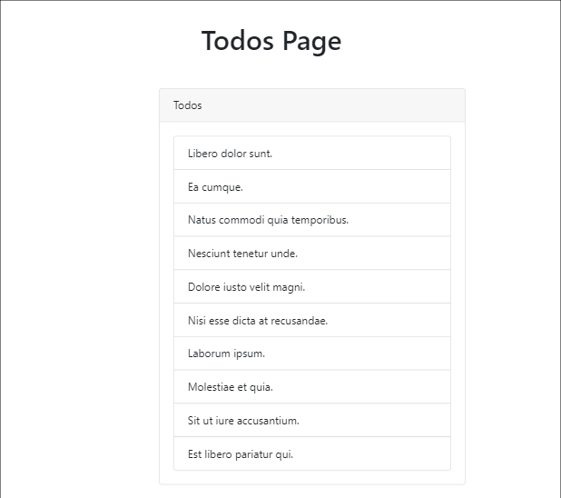
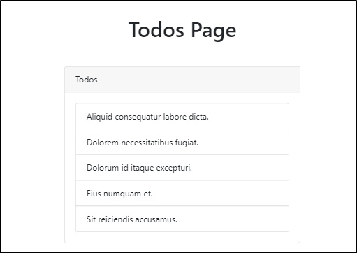
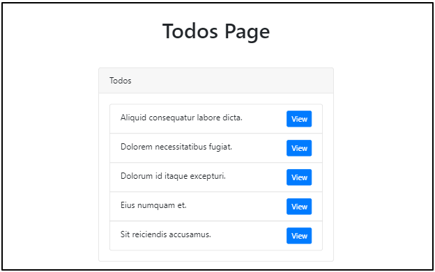

## Bootstrap으로 views 꾸미기  

1. [bootstrap 홈페이지](https://getbootstrap.com) 접속  
2. Bootstrap CDN의 CSS only에 있는 css 주소 복사  
```html
<link rel="stylesheet" href="https://stackpath.bootstrapcdn.com/bootstrap/4.3.1/css/bootstrap.min.css" integrity="sha384-ggOyR0iXCbMQv3Xipma34MD+dH/1fQ784/j6cY/iJTQUOhcWr7x9JvoRxT2MZw1T" crossorigin="anonymous">
```
3. ``todos/index.blade.php`` 파일에 head 태그 안에 복사한 링크 붙여넣기  
4. 이제 bootstrap의 class를 가져다 쓸 수 있다!
```html 
    <h1 class="text-center my-5">Todos Page</h1>

    @foreach($todos as $todo)
```
- list-group class를 사용하고 card 안으로 집어넣자.  

```html 
    <div class="card card-default">
      <div class="card-header">
         Todos
      </div>
      
      <div class="card-body">

        <ul class="list-group">

        @foreach($todos as $todo)
  
          <li class="list-group-item"> {{ $todo->name }} </li> 
        
        @endforeach

        </ul>

      </div>
    </div>  
```

  

- 전체 내용이 화면을 가득 채울 필요가 없으므로 container 안으로 집어넣자.  

```html
    <div class="container">

      <h1 class="text-center my-5">Todos Page</h1>

       <div class="row justify-content-center">

         <div class="col-md-8">
            
            <div class="card card-default">
              <div class="card-header">
                 Todos
              </div>
              
              <div class="card-body">

                <ul class="list-group">

                @foreach($todos as $todo)
  
                  <li class="list-group-item"> {{ $todo->name }} </li> 
                
                @endforeach

                </ul>

              </div>
            </div>  

         </div>
       </div>

    </div>  
```




### migrate refresh  

- 10개 리스트가 좀 많은 것 같아서 5개로 줄이려고 한다. 어떻게 할 수 있을까?  

``database/seeds/TodosSeeder.php`` 파일을 열고 다음을 10에서 5로 수정한다.  

```php
        factory(App\Todo::class, 5)->create(); 
```
그리고 ``php artisan migrate:refresh``를 실행한다.  
이번에는 뒤에 ``--seed``를 붙여서 모든것을 rollback한 다음에 seed 작업을 수행하도록 한다. 

```bash
vagrant@homestead:~/code/todos-app$ php artisan migrate:refresh --seed
Rolling back: 2019_03_25_102408_create_todos_table
Rolled back:  2019_03_25_102408_create_todos_table
Rolling back: 2014_10_12_100000_create_password_resets_table
Rolled back:  2014_10_12_100000_create_password_resets_table
Rolling back: 2014_10_12_000000_create_users_table
Rolled back:  2014_10_12_000000_create_users_table
Migrating: 2014_10_12_000000_create_users_table
Migrated:  2014_10_12_000000_create_users_table
Migrating: 2014_10_12_100000_create_password_resets_table
Migrated:  2014_10_12_100000_create_password_resets_table
Migrating: 2019_03_25_102408_create_todos_table
Migrated:  2019_03_25_102408_create_todos_table
Seeding: TodosSeeder
Database seeding completed successfully.                  
```
  


### 버튼 추가  

각 리스트에 할일을 확인하는 view 버튼을 만들어보자.  

```html

// resources/views/todos/index.blade.php
...
                  <li class="list-group-item">

                    {{ $todo->name }} 
    
                    <button class="btn btn-primary btn-sm float-right">View</button>

                  </li> 
```
  

