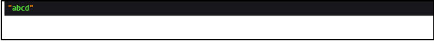
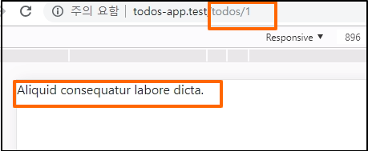
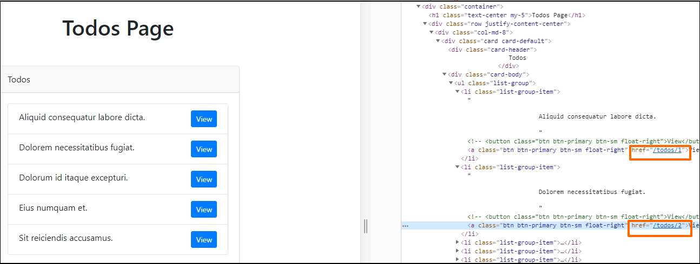
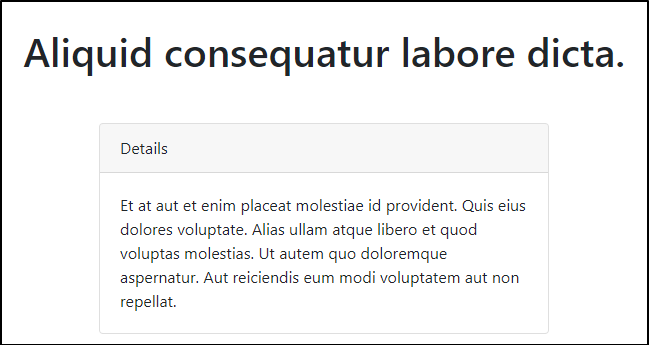

## todo 하나 표시하기  

dynamic routes 시스템을 이용해서 하나의 todo를 클릭하면 상세 내용을 확인할 수
있도록 하자.  

### route 수정  

```php

// routes/web.php

Route::get('todos/{todo}', 'TodosController@show');
```
여기에서 ``{todo}``가 dynamic field의 이름에 해당한다.  
뒤에는 TodosController의 show 메서드를 작성한다.  
이 show 메서드가 하나의 todo를 표시하는 일을 담당할 것이다.  

### controller 수정  

TodosController 파일을 열고 show 메서드를 작성한다.  

```php
// app/Http/Controller/TodosController.php

    public function show($todoId)
    {
        
    }
```
이때 show 메서드의 인자인 ``$todoId``는 다이내믹 데이터에 해당한다.  

우선 dd(die and dump)로 데이터를 확인해보자.  

```php
// app/Http/Controller/TodosController.php

    public function show($todoId)
    {
        dd($todoId);    
    }
```
참고로 dd는 ``die(var_dump($todoId))``를 짧게 줄인 것이다.  

이제 브라우저에서 ``http://todos-app.test/todos/(또는 http://127.0.0.1:8000/todos/)``뒤에 아무거나 붙여서
접속해보자. 

  

뒤에 abcd를 붙여서 접속했고 화면에 abcd가 dump된 것을 확인할 수 있다.  

### model을 사용  

이제 여기에 model을 적용해보자.  
```php
// app/Http/Controller/TodosController.php

    public function show($todoId)
    {
       // Todo 모델의 todoId를 찾아서(?) $todo 변수에 저장
       $todo = Todo::find($todoId);

       // todos.show를 반환하는데, 'todo'라는 이름의 키와 위에서 저장한 $todo 변수를 같이 반환함.
       return view('todos.show')->with('todo', $todo);
    }
```

여기에서, 라라벨은 dynamic한 URL에서 $todoId 형태의 slug를 얻는다. 그리고 Todo
class의 static 메소드 find를 사용해서 $todoId를 찾는다. 그리고 이 데이터를
'todos.show'라는 view로 반환한다.  
(이해가 좀 부족한 설명임..)  

우리한테 아직 이 view가 없기때문에 이제 만들어야한다.  

### show.blade.php 파일 생성  

``resources/views/todos`` 디렉토리 아래에 show.blade.php 파일을 만든다.  
bootstrap도 같이 추가한다. (index.blade.php에서 내용을 복사해서 수정하면 편함)  

```php
// resources/views/todos/show.blade.php

<!DOCTYPE html>
<html lang="en">
<head>
  <meta charset="UTF-8">
  <meta name="viewport" content="width=device-width, initial-scale=1.0">
  <meta http-equiv="X-UA-Compatible" content="ie=edge">
  <link rel="stylesheet" href="https://stackpath.bootstrapcdn.com/bootstrap/4.3.1/css/bootstrap.min.css" integrity="sha384-ggOyR0iXCbMQv3Xipma34MD+dH/1fQ784/j6cY/iJTQUOhcWr7x9JvoRxT2MZw1T" crossorigin="anonymous">
  <title>Todo item</title>
</head>

<body>
	
</body>

</html>
```

우리가 controller에서 'todo'라는 key로 데이터를 불러오기 때문에, 이 view에서
해당 key를 사용해서 다음과 같이 데이터를 표시할 수 있다.  

```php
// resources/views/todos/show.blade.php
...
<body>
  {{ $todo->name }}	
</body>

</html>
```
controller에서, 'todo'는 데이터베이스에서 '$todoId'를 사용해서 데이터를 찾는다.  

우리의 todos 테이블에는 1부터 5까지의 데이터가 있기때문에, 브라우저에서 todoId에
이에 해당하는 숫자를 넣으면 데이터를 볼 수 있다.  

  

### index view 수정  

이제 todos 목록에서 view 버튼을 수정해서 버튼을 누르면 각 todo를 표시하도록 수정하자.  
우선 버튼을 a 태그로 수정한다.  

```php
// resources/views/todos/index.blade.php  


      <a class="btn btn-primary btn-sm float-right" href="/todos/{{ $todo->id }}">View</a>
```
이제 각 목록의 view를 누르면 todo item 페이지로 넘어가는 것을 확인할 수 있다.  
소스를 확인해보면 실제로 ``{{ $todo->id }}``가 각각 숫자로 바뀌어있는 것도
확인할 수 있다.  

  


## show view 수정  

item을 좀더 보기좋게 수정하자.  

```php 
// resources/views/todos/show.blade.php  

  <div class="container">
    <h1 class="text-center my-5">
      {{ $todo->name }}	
    </h1>
  </div>
```
여기에 card class를 추가해서 description을 출력해보자.  
row도 추가해서 예쁘게 다듬는다.  

```php 
// resources/views/todos/show.blade.php  

  <div class="container">
    <h1 class="text-center my-5">
      {{ $todo->name }}	
    </h1>
  
    <div class="row justify-content-center">
      <div class="col-md-6">

        <div class="card card-default">
          <div class="card-header">
            Details
          </div>

          <div class="card-body">
            {{ $todo->description }}
          </div>
        </div>

      </div>
    </div>
    
  </div>
```  
  

