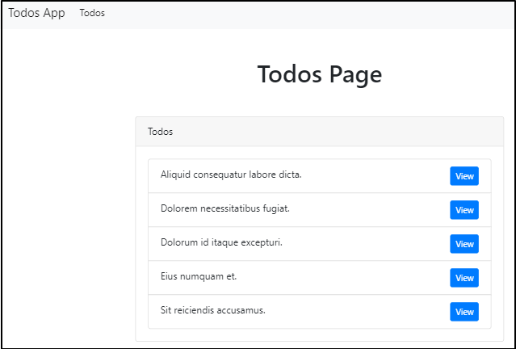

## layout 파일 소개  

``resources/views`` 디렉토리 밑에 있는 blade.php 파일들을 보면, 같은 코드가(주로 head 부분) 반복되는 것을 알 수 있다.  
layout 파일을 만들어서 이렇게 반복되는 부분을 refactor 할 수 있다.  

### layouts 파일 생성  

``resources/view`` 디렉토리에 layouts 디렉토리를 새로 만들고 그 안에 ``app.blade.php`` 파일을 생성한다.  

``todos/index.blade.php``, ``todos/show.blade.php`` 파일에 공통 부분을 잘라내서
``app.blade.php``에 다음과 같이 붙여넣는다.  

```php
// resources/views/layouts/app.blade.php

<!DOCTYPE html>
<html lang="en">
<head>
  <meta charset="UTF-8">
  <meta name="viewport" content="width=device-width, initial-scale=1.0">
  <meta http-equiv="X-UA-Compatible" content="ie=edge">
  <link rel="stylesheet" href="https://stackpath.bootstrapcdn.com/bootstrap/4.3.1/css/bootstrap.min.css" integrity="sha384-ggOyR0iXCbMQv3Xipma34MD+dH/1fQ784/j6cY/iJTQUOhcWr7x9JvoRxT2MZw1T" crossorigin="anonymous">
  <title>Todo item</title>
</head>

<body>
  <div class="container">

  </div>
</body>

</html>
```

### layouts 사용 - section 

이제 container div 안에 다음과 같은 directive를 추가한다.  

```php
// resources/views/layouts/app.blade.php
...
  <div class="container">
    @yield('content')
  </div>
...
```
이것은 섹션을 정의한다. 

이번에는 ``todos/index.blade.php`` 파일을 열고 기존에 container div 안에 있던
내용들을 다음과 같이 '섹션'안으로 집어넣는다.

```php
// resources/views/todos/index.blade.php

@section('content')
      <h1 class="text-center my-5">Todos Page</h1>

       <div class="row justify-content-center">
         <div class="col-md-8">
            
            <div class="card card-default">
              <div class="card-header">
                 Todos
              </div>
              
              <div class="card-body">

                <ul class="list-group">

                @foreach($todos as $todo)
  
                  <li class="list-group-item">

                    {{ $todo->name }} 
    
                    <!-- <button class="btn btn-primary btn-sm float-right">View</button> -->
                    <a class="btn btn-primary btn-sm float-right" href="/todos/{{ $todo->id }}">View</a>
                  
                  </li> 
                
                @endforeach

                </ul>

              </div>
            </div>  

         </div>
       </div>
@endsection
```
그리고 section 위에 이 파일이 우리가 만든 layout을 확장한 것임을 알려주어야 한다.  

```php
// resources/views/todos/index.blade.php

@extends('layouts.app')

@section('content')
```
브라우저에서 원래대로 페이지가 잘 보여지는지 확인한다.  

이제 ``show.blade.php``에서도 똑같은 작업을 해주면 된다.  


### layouts 사용

이번에는 bootstrap의 navbar를 상단에 적용해보자.  

[bootstrap navbar](https://getbootstrap.com/docs/4.3/components/navbar/)   

navbar sample 코드를 복사해서 ``app.blade.php`` 파일에 container div 바로 위에
붙여넣는다.  

```php
// resources/views/layouts/app.blade.php 

...

<nav class="navbar navbar-expand-lg navbar-light bg-light">
  <a class="navbar-brand" href="#">Navbar</a>
  <button class="navbar-toggler" type="button" data-toggle="collapse" data-target="#navbarSupportedContent" aria-controls="navbarSupportedContent" aria-expanded="false" aria-label="Toggle navigation">
    <span class="navbar-toggler-icon"></span>
  </button>

  <div class="collapse navbar-collapse" id="navbarSupportedContent">
    <ul class="navbar-nav mr-auto">
      <li class="nav-item active">
        <a class="nav-link" href="#">Home <span class="sr-only">(current)</span></a>
      </li>
      <li class="nav-item">
        <a class="nav-link" href="#">Link</a>
      </li>
      <li class="nav-item dropdown">
        <a class="nav-link dropdown-toggle" href="#" id="navbarDropdown" role="button" data-toggle="dropdown" aria-haspopup="true" aria-expanded="false">
          Dropdown
        </a>
        <div class="dropdown-menu" aria-labelledby="navbarDropdown">
          <a class="dropdown-item" href="#">Action</a>
          <a class="dropdown-item" href="#">Another action</a>
          <div class="dropdown-divider"></div>
          <a class="dropdown-item" href="#">Something else here</a>
        </div>
      </li>
      <li class="nav-item">
        <a class="nav-link disabled" href="#" tabindex="-1" aria-disabled="true">Disabled</a>
      </li>
    </ul>
    <form class="form-inline my-2 my-lg-0">
      <input class="form-control mr-sm-2" type="search" placeholder="Search" aria-label="Search">
      <button class="btn btn-outline-success my-2 my-sm-0" type="submit">Search</button>
    </form>
  </div>
</nav>

  <div class="container">
...
```
그러면 이 파일에 추가한 것만으로 index, show 파일에 작업할 필요없이 페이지에 navbar를 가지게 된 것을 볼 수 있다.  

### navbar 수정  

form은 필요없으니 지우고, Disabled나 Dropdown, Link 부분도 지운다.  

```php
<nav class="navbar navbar-expand-lg navbar-light bg-light">
  <a class="navbar-brand" href="#">Navbar</a>
  <button class="navbar-toggler" type="button" data-toggle="collapse" data-target="#navbarSupportedContent" aria-controls="navbarSupportedContent" aria-expanded="false" aria-label="Toggle navigation">
    <span class="navbar-toggler-icon"></span>
  </button>

  <div class="collapse navbar-collapse" id="navbarSupportedContent">
    <ul class="navbar-nav mr-auto">
      <li class="nav-item active">
        <a class="nav-link" href="#">Home <span class="sr-only">(current)</span></a>
      </li>
    </ul>
  </div>
</nav>
```
그리고 navbar-brand부분에 있는 Navbar 대신 'Todos App'이라고 변경하고, 링크
주소를 '#' 대신 '/'로 변경한다.  nav-link 에있는 Home을 Todos로 변경하고, 링크주소를  '#'에서 '/todos'로 변경한다.  

  


### title section 사용  

이번에는 title section을 만들고 불러와보자.  
index, show blade 파일에서 title 섹션을 만들고 레이아웃 파일에서 이를 불러온다.  

```php
// resources/views/layouts/app.blade.php 
...
  <title>
    @yield('title')
  </title>
...
```
index 파일에서는 Todos List로 타이틀을 만들고  

```php
// resources/views/todos/index.blade.php 
...
@section('title')

Todos List

@endsection
```
show 파일에는 Single To do 라고 작성한다.  

```php
// resources/views/todos/show.blade.php 
...
@section('title')

Single To do

@endsection
```
이제 브라우저에서 확인해보면 타이틀이 각각 다르게 나타나는 것을 볼 수 있다.  


### 정리  

layout 을 활용하는 방법  

1. views 폴더 아래에 layouts 폴더를 만들고 blade.php 파일을 작성한다.   
2. 공통된 레이아웃 코드들을 1번에서 작성한 blade.php 파일(예: app.blade.php)로
   옮기고 기존 파일에서는 삭제한다.  
3. 공통 레이아웃 코드 자리에 ``@extends('layouts.파일이름')``을 작성해준다.  
4. 하나의 섹션 부분 시작에 ``@section('섹션명')`` 그리고 끝나는 부분에는
   ``@endsection``을 작성한다.  
5. 공통 레이아웃에서 불러올 섹션은 ``@yield('섹션명')``을 사용해서 불러온다.  

