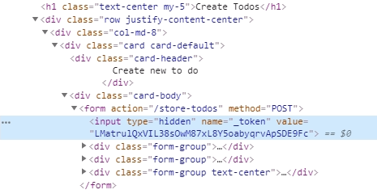

## 새로운 할일 만들기  

데이터베이스에 새로운 record를 생성하는 기능을 만들어보자.  

### view 수정 - 새로운 할일 작성하는 link를 추가  

``resources/views/layouts/app.blade.php``파일을 열고 navbar에 link를 추가한다.  

```php
//resources/views/layouts/app.blade.php
...
      <li class="nav-item active">
        <a class="nav-link" href="/new-todos">Create Todos<span class="sr-only">(current)</span></a>
      </li>
...
```
### route 추가  

방금 작성한 링크 ``new-todos``에 대한 route를 추가한다.  

```php
// routes/web.php

Route::get('new-todos', 'TodosController@create');
```

### controller에서 create 메소드 작성  

create view를 반환하는 create 메소드를 작성한다.  

```php
// app/Http/Controllers/TodosController.php
...
    public function create()
    {
      return view('todos.create');
    }
...
```

### create view 생성  

``resources/views/todos`` 디렉토리 아래에 ``create.blade.php`` 파일을 만들고
다음과 같이 app layout을 확장한 다음 content 섹션을 만든다.  

```php
// resources/views/todos/create.blade.php

@extends('layouts.app')

@section('content')

<form action="">
  <div class="form-group">
    <input class="form-control" type="text" name="name">
  </div>
</form>

@endsection
```
브라우저에서 확인해보면 단순한 입력 필드가 하나 생긴것을 볼 수 있다.  
조금 다듬어보자.  

```php
// resources/views/todos/create.blade.php

...
<h1 class="text-center my-5">Create Todos</h1>

<div class="row justify-content-center">
  <div class="col-md-8">

    <div class="card card-default">

      <div class="card-header">
        Create new to do
      </div>

      <div class="card-body">

        <form action="">
          <div class="form-group">
            <input class="form-control" type="text" name="name" placeholder="Name">
          </div>
        </form>

      </div>

    </div>

  </div>
</div>
...
```

  

다음으로 description 입력하는 부분을 추가한다.  

```php
// resources/views/todos/create.blade.php
...

          <div class="form-group">
            <textarea id="" class="form-control" name="description" cols="5" rows="5" placeholder="Description"></textarea>
          </div>

        </form>
```
submit 역할을 하는 버튼을 추가한다.  

```php
// resources/views/todos/create.blade.php
...
          <div class="form-group text-center">
            <button type="submit" class="btn btn-success">Create Todo</button>
          </div>

        </form>
```

### form 동작하게 만들기  

먼저, form method를 POST 방식으로 동작하게 추가한다.  

```php
// resources/views/todos/create.blade.php
...
      <div class="card-body">

        <form action="" method="POST">
          <div class="form-group">
```
form action에는 '/create-todos' 또는 '/store-todos' 같은 주소를 추가한다.  
그리고 이 주소대로 route를 추가해야 한다. 

```php
// routes/web.php
...
Route::post('store-todos', 'TodosController@store');
```
create 메소드는 새로운 Todos를 추가한다. 그리고 실제로 작성한 Todo를
데이터베이스에 저장하는 역할은 store 메소드가 담당한다.  

TodosController 파일을 열고 store 메소드를 작성한다.  
우선은 die and dump로 테스트를 해보자. 

```php
// app/Http/Controllers/TodosController.php

public function store()
{
  dd(request());
}
```
이제 브라우저에서 아무거나 할 일을 작성하고 Create 버튼을 누르면 '419 | Page
Expired'가 화면에 뜬 것을 볼 수 있다.  

### 419 error??

419 error는 유명한(?)에러로, 이것은 라라벨이 자동적으로 [CSRF(크로스-사이트 요청 위조 공격)](https://en.wikipedia.org/wiki/Cross-site_request_forgery) 보호를 갖고 있기 때문이다.  
매번 post 또는 fetch, delete 요청을 할 때마다 토큰을 라라벨 서버로 보내야한다.  
이것은 Post, Put, delete 요청이 외부로부터 온 것이 아닌지를 확인하는 보호 기능이다.  

이 토큰을 제공하기 위해서는 우리는 라라벨에서 만든 모든 form에 ``@csrf``라는 지시어를 같이 보내야한다.  

```php
// resources/views/todos/create.blade.php
...
        <form action="/store-todos" method="POST">
          @csrf        

          <div class="form-group">
```
이렇게 하고 브라우저에서 소스를 확인해보면, 지시어 자리에 다음과 같이 hidden
input이 들어간 것을 확인할 수 있다.  

  

바로 이 hidden input으로 들어간 토큰이, 이 form으로 보내는 요청이 우리 내부
웹사이트에서 보낸 요청을 확인하는 것이다.  

다시 작성하고 버튼을 누르면 다음과 같이 dump된 화면을 볼 수 있다.  

  

### request object

우리가 store 메소드에서 die and dump로 호출한 request는 사용자가 서버로 보낸
현재 요청에 대한 instance를 보내준다(? 무슨 말인지 잘 이해 못했음..) 

만약 사용자가 form을 통해서 보낸 data를 전부 보고싶으면 다음과 같이 하면 된다.  

```php
// app/Http/Controllers/TodosController.php

public function store()
{
  dd(request()->all());
}
```
  

### data 저장하기  

```php
// app/Http/Controllers/TodosController.php

public function store()
{
  //dd(request()->all());

  $data = request()->all();

  $todo = new Todo();   // Todo 모델 class 기반으로 $todo 인스턴스 생성
  
  // $todo->name, $todo->description은 데이터베이스의 해당 테이블 필드.
  $todo->name = $data['name'];
  $todo->description = $data['description'];
  $todo->completed = false;

  // save 메소드로 데이터베이스에 저장  
  $todo->save();

  // 저장 후에 todos 페이지로 돌아오기  
  return redirect('/todos');
}
```
브라우저에서 확인해보면 다음과 같이 새로 작성한 항목이 추가된 것을 볼 수 있다.  

  

