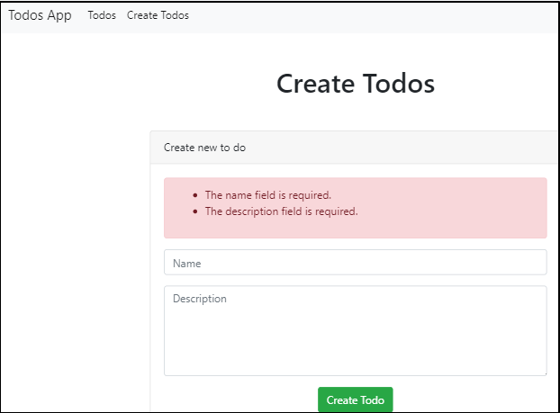
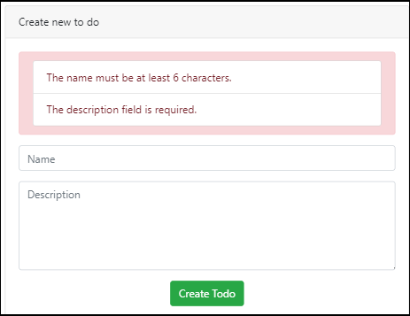

## 데이터 검증하기  

좀 전에 만든 form에서 값이 빈 채로 create 버튼을 누르면 에러가 발생한다.  
메시지는 대략 ``Column 'name' cannot be null``이라고 나오는데, 데이터베이스에
저장해야할 필드를 비워두었기 때문이다.  
데이터를 보내기 전에 데이터를 체크하는 일이 필요하다.  

### controller의 store 메소드 수정하기  

```php
// app/Http/Controllers/TodosController.php

    public function store()
    {
      $this->validate();

      $data = request()->all();
...
```

### validate 

validate() 함수가 어디에서 오는거냐하면, TodosController가 extends하는
Controller class에서 온다.  

실제로 Controller.php 파일을 열어보면 Controller class안에 다음과 같이 몇 개의
traits를 가지고 있고, 그 중 'ValidatesRequests'라는 trait가 있다. 이 trait가
우리가 사용하는 validate 함수를 가지고 있다.  

```php
// app/Http/Controllers/Controller.php

class Controller extends BaseController
{
    use AuthorizesRequests, DispatchesJobs, ValidatesRequests;
}
```
다시 store 메소드로 돌아가서, 이 validate 함수는 인자로 우리가 검증하려는
request의 인스턴스를 받는다.  

```php
// app/Http/Controllers/TodosController.php

    public function store()
    {
      $this->validate(request());
...
```
다음으로는 검증 규칙(validation rules)의 배열을 인자로 받는다.  
예를 들어, name과 description 항목이 반드시 작성되어야 한다면 다음과 같이
적는다.  

```php
// app/Http/Controllers/TodosController.php

    public function store()
    {
      $this->validate(request(), [
          'name' => 'required',
          'description' => 'required'
          ]);
...
```

### 검증에 대한 결과 보여주기  

사용자가 필드를 비워둔채로 create 버튼을 누르면 아무런 에러 메시지 없이 그냥
원래 페이지로 다시 돌아온다. create 페이지를 수정해서 결과를 표시하도록 하자.  

라라벨 문서를 참고하려면
[여기](https://laravel.com/docs/5.8/validation#quick-displaying-the-validation-errors)  

```php
// resources/views/todos/create.blade.php
...
      <div class="card-body">

        @if ($errors->any())
          <div class="alert alert-danger">
            <ul class="list-group">
              @foreach ($errors->all() as $error)
              <li class="list-group-item">
                {{ $error }}
              </li>
              @endforeach
            </ul>
          </div>
        @endif
  
        <form action="/store-todos" method="POST">
...
```
  

### 검증 규칙 추가  

만약 검증 규칙을 추가하고 싶다면 어떻게 할까?  
controller 파일에 추가할 수 있다.  

예를 들어 최소 6글자 최대 12글자로 제한하는 검증 규칙을 추가한다면 다음과 같이
할 수 있다.  

```php
// app/Http/Controllers/TodosController.php

    public function store()
    {
      $this->validate(request(), [
        'name' => 'required|min:6|max:12',
        'description' => 'required' 
      ]);
```

  

