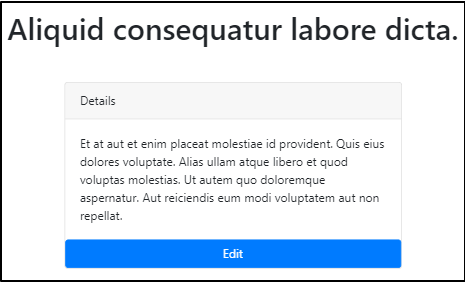

## todos 업데이트하기  

라라벨에서 데이터베이스의 데이터를 업데이트하는 방법을 알아보자.  

### edit 버튼 추가하기  

todos에 edit 버튼을 추가해서 수정할 수 있도록 한다.  

```php
// resources/views/todos/show.blade.php

...
          <div class="card-body">
            {{ $todo->description }}
          </div>

        <a class="btn btn-info">Edit</a>

        </div>
...
```
그리고 a 태그에 다음과 같이 링크를 만든다.  

```php
// resources/views/todos/show.blade.php

...
        <a href="/todos/{{ $todo->id }}/edit" class="btn btn-info">Edit</a>
...
```
  

버튼의 스타일을 약간 수정하고 card 밖으로 이동시킨다.  

```php
// resources/views/todos/show.blade.php
...
          <div class="card-body">
            {{ $todo->description }}
          </div>

        </div>

        <a class="btn btn-info btn-sm my-2 float-right" href="/todos/{{ $todo->id }}/edit">Edit</a>

      </div>
...
```
  

### route 추가  

```php
// routes/web.php

Route::get('todos/{todo}/edit', 'TodosController@edit');
```

### 컨트롤러에 edit 메소드 추가  

```php
// app/Http/Controllers/TodosController.php

public function edit($todoId)
{
}
```
edit 메소드는 '$todoId'를 인자로 받는데, 이 인자는 어디서 오는가 하면, edit
route에서 ``todos/{todo}/edit``로 중간에 {todo} 부분이 다이내믹하게 들어오게
되어있다. 라라벨은 자동적으로 이 부분을 감지해서 edit 메소드에 인자로
전달해준다.  

```php
// app/Http/Controllers/TodosController.php

    public function edit($todoId)
    {
      $todo = Todo::find($todoId);

      return view('todos.edit')->with('todo', $todo);
    }
```
edit 메소드를 설명하면 다음과 같다. 
1. url로부터 $todoId를 인자로 받는다.
2. $todoId에 해당하는 todo 데이터를 찾는다.  
3. 2번에서 찾은 데이터를 가지고 edit view를 반환한다.  

### edit view 추가  

``resources/views/todos`` 디렉토리 아래에 ``edit.blade.php`` 파일을 만든다.  
create.blade.php와 내용이 거의 흡사하므로 복사해서 만든다.  

create를 edit로 고치고 form의 action 경로를 store에서 update로 수정한다.  
그리고 input 필드에 기존 값을 불러온다.  

```php
// resources/views/todos/edit.blade.php

        <form action="/update-todos" method="POST">
          @csrf        

          <div class="form-group">
            <input class="form-control" type="text" name="name" placeholder="Name" value="{{ $todo->name }}">
          </div>

          <div class="form-group">
            <textarea id="" class="form-control" name="description" cols="5" rows="5" placeholder="Description">{{ $todo->description }}</textarea>
          </div>

          <div class="form-group text-center">
            <button class="btn btn-success" type="submit">Update Todo</button>
          </div>

        </form>
```

  

### update-todos route 추가  

form-action의 경로로 적은 update-todos의 route를 추가한다.  

```php
// routes/web.php

Route::post('update-todos', 'TodosController@update');
```

### update 메소드 추가  

controller에 update 메소드를 추가한다.  

```php
// app/Http/Controllers/TodosController.php

    public function update()
    {
      
      $this->validate(request(), [
        'name' => 'required|min:6|max:12',
        'description' => 'required' 
      ]);

      $data = request()->all();
    }
```
일단 이렇게 작성한 다음, 2가지 방식으로 다음 작업을 할 수 있다.

- 첫번째는 hidden input으로 id를 넘기는 방식이다.  

edit view에 ``<input name="todo_id" type="hidden" value="{{ $todo->id }}">``를
추가해서 form으로 같이 넘기는 방법.  

- 두번째는 update route를 다음과 같이 수정한다음, 
``Route::post('todos/{todo}/update-todos', 'TodosController@update')``
edit view의 form-action 경로를 ``/todos/{{ $todo->id }}/update-todos``로
변경한다.  

*두번째 방식으로 작업하기로 하자.*

```php
// routes/web.php

Route::post('todos/{todo}/update-todos', 'TodosController@update');
```

```php
// resources/views/todos/edit.blade.php

        <form action="/todos/{{ $todo->id }}/update-todos" method="POST">
          @csrf        
```
update 메소드를 마저 수정한다. 이번에는 인자로 $todoId를 받도록 한다.  

```php
// app/Http/Controllers/TodosController.php

    public function update($todoId)
    {
      
      $this->validate(request(), [
        'name' => 'required|min:6',
        'description' => 'required' 
      ]);

      $data = request()->all();
  
      $todo = Todo::find($todoId);
      $todo->name = $data['name'];
      $todo->description = $data['description'];
            
      $todo->save();

      return redirect('/todos');
    }
```
이제 수정이 잘 되는 것을 확인할 수 있다.  

