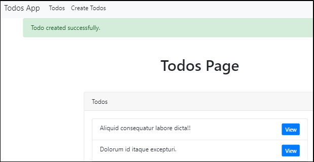

## 메시지를 나타났다가 사라지게 만들기  

어플리케이션에서 일어나는 일에 대한 메시지를 나타나게 하는 방법을 알아보자.  

### controller 수정  

session 함수와 flash 함수를 호출해서 메시지를 출력한다.  

```php
// app/Http/Controllers/TodosController.php

    public function store()
    {
      ...

      $todo->save();

      session()->flash('success', 'Todo created successfully.');

      return redirect('/todos');
    }
```

### view 수정  

사용자가 이 메시지를 볼 수 있게 표시를 해 준다.  
이 메시지를 어떤 view에서도 보여지게 하고 싶으므로, 특정 view가 아닌 layouts의
app.blade.php 파일을 수정한다. 

```php
// resources/views/layouts/app.blade.php

  <div class="container">

    @if(session()->has('success'))
      
      <div class="alert alert-success"> {{ session()->get('success') }} </div>
    
    @endif

    @yield('content')

  </div>
```

브라우저에서 새로 todo를 만들면 다음과 같이 메시지를 띄워준다.

  

### update, delete 에도 메시지를 띄워주기  

store 메소드에 추가한 것 처럼 update, delete 메소드에도 똑같이 적용해준다.  

```php
// app/Http/Controllers/TodosController.php

    public function update(Todo $todo)
    {
      ...      

      $todo->save();

      session()->flash('success', 'Todo updated successfully.');

      return redirect('/todos');
    }
...

    public function destroy(Todo $todo)
    {
      $todo->delete();

      session()->flash('success', 'Todo deleted successfully.');

      return redirect('/todos');
    }
```
이제 브라우저에서 todo를 삭제하거나 업데이트 할 때도 메시지가 뜨는 것을 확인할
수 있다.  

### 정리  

어플리케이션에서 flash 메시지를 나타내려면  

1. session() 을 호출한다. 
2. session 함수는 key와 value를 가진 flash 함수를 호출한다.  
   value부분은 보여지는 메시지가 된다.   
   ``session()->flash('key 부분', 'value 부분')``

3. view에서 출력할때는 session이 우리가 controller에서 정의한 key를 가지고
있는지를 체크한다.   
   ``@if(session()->has('key 부분'))``
4. key를 가지고 있을 경우 메시지를 출력한다.  
   ``{{ session()->get('key 부분') }}``

