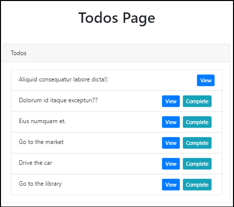
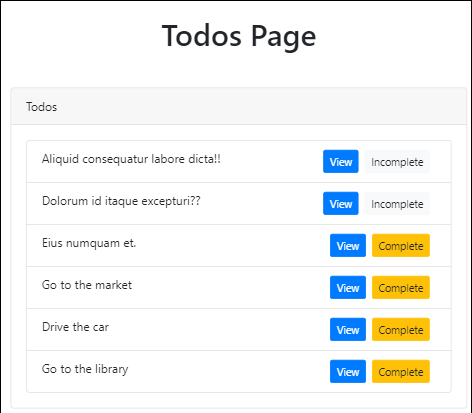

## todos 완료처리하기  

각 todos 리스트에 완료 버튼을 만들고, 버튼을 눌러서 완료처리를 할 수 있게
만든다.  

### view 수정  

complete 버튼 추가.  

```php
// resources/views/todos/index.blade.php

                  <li class="list-group-item">

                    {{ $todo->name }} 
    
		            @if($todo->completed == false)

		              <a class="btn btn-info btn-sm mx-2 float-right" href="/todos/{{ $todo->id }}/complete">Complete</a>

		            @endif		
	
                    <a class="btn btn-primary btn-sm float-right" href="/todos/{{ $todo->id }}">View</a>

                  </li> 
```

### complete route 추가  

```php
// routes/web.php

Route::get('todos/{todo}/complete', 'TodosController@complete');
```

### complete 메소드 추가  

```php
// app/Http/Controllers/TodosController.php

    public function complete(Todo $todo)
    { 
      $todo->completed = true;
      $todo->save();

      session()->flash('success', 'Todo completed');

      return redirect('/todos');
    }
```
  

### incomplete 추가 

똑같은 방식으로 해서 incomplete 버튼을 추가함

```php
// resources/views/todos/index.blade.php

		            @if($todo->completed == false)

		              <a class="btn btn-warning btn-sm mx-2 float-right" href="/todos/{{ $todo->id }}/complete">Complete</a>

                    @else
                      
		              <a class="btn btn-light btn-sm mx-2 float-right" href="/todos/{{ $todo->id }}/incomplete">Incomplete</a>

		            @endif		
```
controller, route 부분은 똑같으므로  생략.

  

