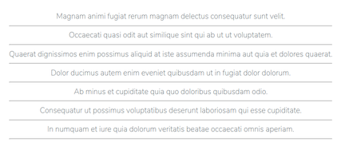

## Model Factories and Controllers

### Todos Controller 

아까 new Controller를 만든 것처럼 이번에는 Todos controller를 생성한다.  

```bash
vagrant@homestead:~/code/Todos$ php artisan make:controller TodosController
Controller created successfully.
```
이제 Todos를 위한 control작업은 이 파일 내에 class안에 작성하면된다.  
> app/Http/Controllers/TodosController.php
```php
<?php

namespace App\Http\Controllers;

use Illuminate\Http\Request;

class TodosController extends Controller
{
    //
}
```
즉, 여기에서 Create, Read, Update, Delete를 작성하게 되는 것이다.  

### Model Factories

이제 작업을 위해 Dummy 데이터가 필요하다.  
Laravel은 'Model factories'라는 것을 제공함으로써 이 작업을 쉽게 만들어준다.  
Model factory는 이 dummy 데이터를 데이터베이스에 생성해주는 것이다.  

```bash
/Todos/database/factories/UserFactory.php
// 5.4 이하에서는 이 파일이름이 'ModelFactory'였던 것 같다.
```
이 파일을 열어보면 다음과 같은 내용이 있는데  
```php
use Faker\Generator as Faker;
...중략...

$factory->define(App\User::class, function (Faker $faker) {
    return [
        'name' => $faker->name,
        'email' => $faker->unique()->safeEmail,
        'email_verified_at' => now(),
        'password' => '$2y$10$TKh8H1.PfQx37YgCzwiKb.KjNyWgaHb9cbcoQgdIVFlYg7B77UdFm', // secret
        'remember_token' => str_random(10),
    ];
});
```
이 부분은 즉 faker Generator를 통해 User를 만들어주는 것이다.  
Faker Generator는 fake data을 만들어주는 PHP Library이다.  
[Faker](https://github.com/fzaninotto/Faker)  

1. todos 테이블에 대한 dummy 데이터 만들기  
sentence(10)은 10개의 단어로 이루어진 문장
```php
$factory>define(App\Todo::class, function (Faker $faker) {
  return [
    'todo' => $faker->sentence(10)

  ];
});
```
2. seeds
seeds는 말그대로 씨앗이다. 데이터베이스에 데이터를 '심는'것이다. 
seeder 만들기  
```bash
vagrant@homestead:~/code/Todos$ php artisan make:seeder TodosTableSeeder
Seeder created successfully.
```
이제 database/seeds/TodosTableSeeder.php 파일을 볼 수 있다.  
이 파일이 하는 일은 database seeds를 실행하는 것이다.  

여기에서 우리는 factory 메서드를 호출한다. 이 method는 Model(App\Todo)과 생성할 fake데이터 수를 인자로 받는다.  
그리고 create method에 연결한다.
```php
    public function run()
    {
      factory(App\Todo::class, 7)->create();
    }
```
자, 이제 이 seeder를 어떻게 실행할까?  
database seeder에 이것을 등록해야한다.  
> DatabaseSeeder.php
```php
    public function run()
    {
        // $this->call(UsersTableSeeder::class);
      $this->call(TodosTableSeeder::class);
    }
```
3. seeder 실행  
seed database 명령은 db:seed 이다  
```bash
vagrant@homestead:~/code/Todos$ php artisan db:seed
Seeding: TodosTableSeeder
Database seeding completed successfully.
```
4. 데이터베이스 확인  
```sql
MariaDB [todos]> select * from todos;
+----+-------------------------------------------------------------------------------------------------+-----------+---------------------+---------------------+
| id | todo                                                                                            | completed | created_at          | updated_at          |
+----+-------------------------------------------------------------------------------------------------+-----------+---------------------+---------------------+
|  1 | Magnam animi fugiat rerum magnam delectus consequatur sunt velit.                               |         0 | 2018-10-31 13:29:27 | 2018-10-31 13:29:27 |
|  2 | Occaecati quasi odit aut similique sint qui ab ut ut voluptatem.                                |         0 | 2018-10-31 13:29:27 | 2018-10-31 13:29:27 |
|  3 | Quaerat dignissimos enim possimus aliquid at iste assumenda minima aut quia et dolores quaerat. |         0 | 2018-10-31 13:29:27 | 2018-10-31 13:29:27 |
|  4 | Dolor ducimus autem enim eveniet quibusdam ut in fugiat dolor dolorum.                          |         0 | 2018-10-31 13:29:27 | 2018-10-31 13:29:27 |
|  5 | Ab minus et cupiditate quia quo doloribus quibusdam odio.                                       |         0 | 2018-10-31 13:29:27 | 2018-10-31 13:29:27 |
|  6 | Consequatur ut possimus voluptatibus deserunt laboriosam qui esse cupiditate.                   |         0 | 2018-10-31 13:29:27 | 2018-10-31 13:29:27 |
|  7 | In numquam et iure quia dolorum veritatis beatae occaecati omnis aperiam.                       |         0 | 2018-10-31 13:29:27 | 2018-10-31 13:29:27 |
+----+-------------------------------------------------------------------------------------------------+-----------+---------------------+---------------------+
7 rows in set (0.001 sec)
```

----

### dummy 데이터를 가져오는방법  

기본 work flow는 이렇다.  
먼저, view가 있다. 사용자가 여기에서 요청을 보낼 것이다.   
router가 그 요청을 받는다. 그리고 그 요청을 특정 컨트롤러로 보낸다.  
그러면 그 컨트롤러에서는 method를 실행하고 결과를 데이터베이스로 보낸다.  
그다음 그 결과를 사용자에게 반환한다.  

1. Read 데이터베이스로부터 읽어오기  
  - 일단 사용자가 데이터를 보겠다는 요청을 해야한다.  
    - welcome view를 복사해서 todos view를 만들고 조금 내용을 수정한다.  
```bash
resources/views $ cp welcome.blade.php todos.blade.php
```

2. Route 추가  
> routes/web.php
```php
Route::get('/todos', [
  'uses' => 'TodosController@index' 
]);
```
3. Controller에 index method 추가  
todos view를 반환한다.
> app/Http/Controllers/TodosController.php
```php
class TodosController extends Controller
{
   public function index() {
     return view('todos');
  }
}
```
4. 브라우저 접속  
``todos.test/todos``로 접속해보면 아까 view로 만든 화면이 보인다.  
  

5. todo 목록의 반환  
일단 지금은 view를 반환하긴 하는데 우리는 todo 목록을 반환해야 한다.  
- TodosController.php에 App\Todo class를 사용하게 만든다.  
> TodosController.php
```php
use App\Todo;
```
이렇게 하면 todos 데이터베이스와 상호작용이 가능(?)하다.  
> TodosController.php
```php
   public function index() {
     $todos = Todo::all();

     return view('todos')->with('todos', $todos);
  }
```
6. view 수정  
> todos.blade.php
```php
                  <?php foreach ($todos as $todo): ?>
                  <?php echo $todo->todo; ?>
                  <?php endforeach; ?>
```
보통 같으면 이런식으로 작성하겠지만, laravel에서는 다음과 같이 할 수 있다.  
```php
@foreach ($todos as $todo)
  {{ $todo->todo }}
  <br>
@endforeach
```
하지만 이 상태로는 글씨가 너무 크기 때문에 상단에서 title 글씨 크기를 조금
줄이고 가로줄을 끼워넣어 가독성을 높이자.  
```php
            .title {
               /* font-size: 84px; */
              font-size: 1.2em;
            }
```
결과  
  

