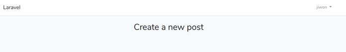

## post, category model

1. post model 생성  

```bash
vagrant@homestead:~/code/blog$ php artisan make:model Post -m
Model created successfully.
Created Migration: 2018_11_02_062032_create_posts_table
```
이제 app 디렉토리 아래에 Post.php 파일이 생성되고  
database/migrations 아래에는 위의 파일이 생성된 것을 확인할 수 있다.  

2. create_posts_table 파일 수정 
- title, content, category_id, featured(image link)를 추가  
```php
        Schema::create('posts', function (Blueprint $table) {
            $table->increments('id');
            $table->integer('category_id');
            $table->string('title');
            $table->text('content');
            $table->string('featured');
            $table->timestamps();
        });
```
3. category model 생성  
```bash
vagrant@homestead:~/code/blog$ php artisan make:model Category -m
Model created successfully.
Created Migration: 2018_11_02_062819_create_categories_table
```
4. created_categories_table 파일 수정  
- name 추가  
```php
        Schema::create('categories', function (Blueprint $table) {
            $table->increments('id');
            $table->string('name');
            $table->timestamps();
        });
```

## Relationships
Laravel에서 'Relationships'라는 것은 데이터 테이블 간의 관계를 말한다.  

여기에서 다룰 것은 'posts'와 'categories' 테이블의 관계이다.  
- post는 하나의 카테고리에 속할 수 있다.
  (사실 여러 카테고리에 속할 수 있어야 맞는데...)  
- category는 많은 posts를 가질 수 있다.  

이렇게 관계를 정의했으면 이제 모델을 수정할 차례이다.  

1. category model 수정  
> app/Category.php
```php
class Category extends Model
{
  public function posts()
  {
    return $this->hasMany('App\Post');
  }
```
class와 함수 이름대로 관계를 읽을 수 있다(?)
Category have many posts.

2. post model 수정  
> app/Post.php
```php
class Post extends Model
{
  public function category()
  {
    return $this->belongsTo('App\Category');
  }
}
```
Post는 category에 속한다.  

---

## post view

1. post controller 생성  
```bash
vagrant@homestead:~/code/blog$ php artisan make:controller PostsController --resource
Controller created successfully.
```
만들어진 파일을 확인해보면 이전과 다르게 더 많은 method가 준비되어있다.  

2. views 아래에 admin/posts 폴더 생성  
그리고 그 아래에 create.blade.php 파일 생성  
> create.blade.php
```php
@extends('layouts.app')

@section('content')
<h2 class="text-center">
  Create a new post
</h2>

@stop
```
3. route 새로 생성  
> web.php
```php
Route::get('/post/create', [
  'uses' => 'PostsController@create',
  'as'   => 'post.create'
]);
```
PostsController 안에 create method를 사용하고, 그 이름은 post.create로 쓴다는
것인듯(?)

4. PostsController 파일 수정  
> PostsController.php
```php
    public function create()
    {
      return view('admin.posts.create');
    }
```
5. 브라우저에서 확인  
``blog.test/post/create``로 접속해보면 다음과 같은 화면이 출력된다.  
  


## post form  

1. side navigation  
> resources/views/layouts/app.blade.php
```php
        <main class="py-4">
            @yield('content')
        </main>
// 위 부분을 지우고 
```
```php
<div class="container">
  <div class="row">
    <div class="col-lg-4">

// 여기에 side navigation 자리

    </div>
    <div class="col-lg-8">
      @yield('content')
    </div>
  </div>
</div>
```
- side navigation 작성  
```php
    <!-- side navigation -->
      <ul class="list-group">
        <li class="list-group-item">
          <a href="/post/create">Create new post</a>
        </li>
      </ul>
```
- home.blade.php에서 겹치는 부분 걷어냄  
> home.blade.php
```php
// 아래의 3개의 div 삭제  
<div class="container">
    <div class="row justify-content-center">
        <div class="col-md-8">
```
- side에서 home 링크 추가  
> app.blade.php
```php
        <li class="list-group-item">
          <a href="/home">Home</a>
        </li>
```
2. create post view
> create.blade.php
```php
// 아래의 내용을 지우고 
<h2 class="text-center">
  Create a new post
</h2>
```
```php
<div class="panel panel-default">
  <div class="panel-heading">
    Create a new post
  </div>
</div>
```
- form 추가  
```php
  <div class="panel-body">
    <form action="/post/store" method="post">
      
    </form>
  </div>
```
- form에 csrf_field 추가  
Laravel이 cross check를 해서 데이터가 이 애플리케이션에서 온 것임을 확인하도록
하는 것. form에서 submit을 하면 token을 같이 보낸다.  
```php
  <div class="panel-body">
    <form action="/post/store" method="post">
      {{ csrf_field() }}      
    </form>
  </div>
```
- form group 추가  
이제 posts table에 데이터를 넣기 위한 폼 그룹을 만든다.  

- **중요! panel은 bootstrap4에서는 더이상 쓰이지 않음. card로 변경**
panel을 card로 바꾸어야 한다.(강좌에서는 panel로 작성됨)  
```php
<div class="card card-default">
  <div class="card-header">
    새 포스트 작성
  </div>
  
  <div class="card-body">
    <form action="/post/store" method="post">
      {{ csrf_field() }}
      <div class="form-group">
        <label for="title">제목</label>
        <input class="form-control" type="text" name="title">
      </div>

      <div class="form-group">
        <label for="featured">본문 이미지</label>
        <input class="form-control" type="file" name="featured">
      </div>

      <div class="form-group">
        <label for="content">본문 내용</label>
        <textarea name="content" id="content" class="form-control" cols="5" rows="5"></textarea>
      </div>

      <div class="form-group">
        <div class="text-center">
          <button class="btn btn-success" type="submit">작성완료</button>
        </div>
      </div>
      

    </form>
  </div>
```
폼이 만들어졌다. 이제 버튼을 누르면 아직 /post/store가 없기때문에 동작하지
않으므로 route를 작성하자.  

3. /post/store에 대한 route 작성  
> routes/web.php
```php
Route::post('/post/store', [
  'uses' => 'PostsController@store',
  'as'   => 'post.store'
]);
```
4. store method 작성  
> app/Http/Controllers/PostsController.php
```php
    public function store(Request $request)
    {
      // 우선 die and dump를 해본다.
      dd($request->all());
    }
```

## route groups

우선 더 진행되기 이전에, 한가지 문제가 있다.  
현재 상태에서 로그아웃을 하고나서도 여전히 post를 작성하는 화면이 뜬다.  

1. route groups?
web.php 파일에서 보면 /post/create와 /post/store는 공통점이 있는데, 바로 허가된
사용자만 접근할 수 있어야 한다는 점이다.  
이들을 묶어서 그룹을 만들자.  

```php
Route::group(['prefix' => 'admin'], function() {
  // 기존 2개의 route 집어넣음
});
```
이제 이렇게 하고나면 기존의 /post/create 대신 'admin'이 들어간 URL로 접근이
가능하다. /admin/post/create로 접속해보면 원래의 화면을 볼 수 있다.  

2. form에서 링크 수정  
> create.blade.php
```php
    <form action="{{ route('post.store') }}" method="post">
```
> app.blade.php
```php
        <li class="list-group-item">
          <a href="{{ route('post.create') }}">Create new post</a>
        </li>
```

## middleware

링크는 수정했지만 여전히 로그인 상태가 아닌데도 포스트 작성이 가능하다.  
middleware는 일종의 필터라고 생각하면 된다.  
middleware가 어떤 요청을 중간에서 먼저 받아서 확인하고 넘겨주는 것이다.  
"이 사용자가 권한이 있는가?"를 판단, 있으면 넘겨주고 없으면 거절한다.  

이 역할을 하는 'authentication middleware'를 끼워넣겠다.  
> web.php
```php
Route::group(['prefix' => 'admin', 'middleware' => 'auth' ], function() {
```
이렇게 middleware를 끼워넣으면 이제 새 포스트를 작성하려고 하면 로그인 화면이  
먼저 나오게 된다.  

한가지 더, 우리는 로그인 상태가 아니면 새 포스트를 작성하는 메뉴도 볼 수 없어야
한다.  
> app.blade.php
```php
    @if(Auth::check())

    <div class="col-lg-4">

    <!-- side navigation -->
    ....

    @endif
```

**여기에서 문제가 발생했음. login form이 한쪽으로 쏠려서 나타나는 것.** 
해결책은 다음과 같다.  

1. login.blade.php, register.blade.php 수정  
```php
// 다음의 3줄을 삭제(또는 비활성화) 
<!-- <div class="container">
    <div class="row justify-content-center">
        <div class="col-md-8">  -->
```
2. app.blade.php에서 row div에 가운데정렬 추가  
```php
            <div class="row justify-content-center">
```
이렇게 하니까 가운데로 로그인과 레지스터 폼이 오게됨.  
---

## more on middleware  

1. home은 왜?  
web.php를 보면 route group안에 home이 없는데도 불구하고 로그인 상태가 아니면  
home에 접근이 안된다. 그 이유는 바로 HomeController.php 파일 안에 다음과 같은
내용이 있기 때문이다.  
```php
    public function __construct()
    {
        $this->middleware('auth');
    }
```
이 부분을 비활성화 시키자. 그러면 로그인 없이도 home에 접근이 가능하다.  

2. home route를 route group안으로  
하지만  우리는 home에 로그인 없이 접근하는 것을 원치 않으므로, home route부분을
route그룹안으로 옮기도록 하자.  

3. 링크를 수정  
> app.blade.php
```php
                    <a href="{{ route('home') }}">Home</a>
```
4. 접속 url은 '/admin/home'으로  
원래 ``blog.test/home'으로 접속했지만 이제 ``blog.test/admin/home``으로 접근해야
한다.  

5. home route에 관해서..
강좌에서는 home route를 다음과 같이 수정하는데  
```php
Route::get('/home', [
    'uses' => 'HomeController@index',
    'as'   => 'home'
  ]);
```
그런데 수정하지 않고 아래처럼 그냥 두어도 아무 문제가 없어서 일단 그냥 두려고
한다.  
```php
  Route::get('/home', 'HomeController@index')->name('home');
```
6. home route 하나더  
app/Http/Middleware 디렉토리에 보면 여러가지 파일들이 있는데, redirect에 관련된
파일을 열어 다음을 수정한다.  
> RediretAuthenticated.php
```php
    public function handle($request, Closure $next, $guard = null)
    {
        if (Auth::guard($guard)->check()) {
            return redirect('/home');
        }

        return $next($request);
    }
```
이 부분에서 redirect('/home')을 ('/admin/home')으로 수정해야 정상적으로
동작한다.  


