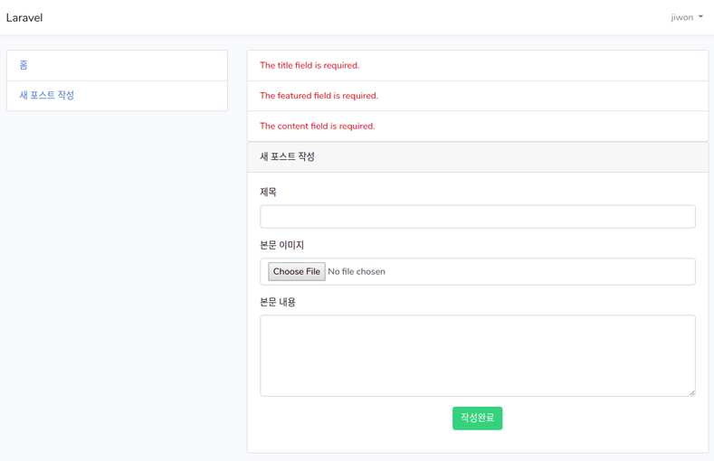

## Data validation  

form을 통해 받은 데이터를 데이터베이스에 집어넣도록 해보자.  
집어넣기 전에 먼저 데이터에 대한 검증이 이루어져야 한다.  
PostsController.php 파일을 열어보면 이 class는 기본 Controller를 확장한 것임을
알 수 있는데, Controllers.php 파일을 열어보면 다음과 같은 3개의 'base
controller'를 사용하고 있는 것을 알 수 있다. 
```php
    use AuthorizesRequests, DispatchesJobs, ValidatesRequests;
```
이 중에서 'validateRequests'를 이용해서 검증작업을 할 수 있다.  

1. PostsController
> app/Http/Controllers/PostsController.php
```php
    public function store(Request $request)
    {
    //  dd($request->all());
      $this->validate($request, [
        'title'    => 'required|max:255',
        'featured' => 'required|image',
        'content'  => 'required'
      ]);
    }
```
이렇게 한 다음 브라우저에서 확인해보면 아무런 변화가 없는 것을 알 수 있는데,
이것은 에러가 표시되도록 하지 않았기 때문이다.  

2. 에러 표시  
> create.blade.php
```php
@if(count($errors) > 0)
  <ul class="list-group">

    @foreach($errors->all() as $error)
  
      <li class="list-group-item text-danger">
        {{ $error }}
      </li>

    @endforeach
  </ul>
@endif
```
  
이제 상단에 에러가 표시된다.  

그런데 이번에는 내용을 제대로 채우고 작성완료를 보내도 여전히 image를 인식하지
못하고 에러가 표시된다. 다음과 같은 내용을 추가해주어야 한다.  

> create.blade.php
```php
  <div class="card-body">
    <form action="{{ route('post.store') }}" method="post" enctype="multipart/form-data">
```
이제 에러 메시지가 사라진 것을 확인할 수 있다.  


