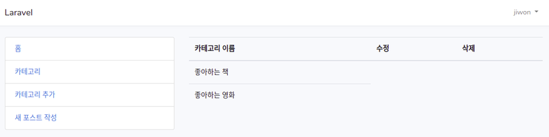

# Categories CRUD

## Create  

1. 새 Category 메뉴 추가  
> app.blade.php
```php
                  <li class="list-group-item">
                    <a href="{{ route('category.create') }}">카테고리 추가</a>
                  </li>
```
2. route 추가  
> web.php
```php
// 이것도 route group안에 들어가야한다.  
  Route::get('/category/create', [
    'uses' => 'CategoriesController@create',
    'as'   => 'category.create'
  ]);
```

3. controller 추가  
```bash
vagrant@homestead:~/code/blog$ php artisan make:controller CategoriesController --resource
Controller created successfully.
```

4. category view 추가  
- /resources/views/admin 아래에서 'categories' 폴더 만들기  
- categories 폴더에 posts의 create.blade.php를 복사해서 'create.blade.php' 파일 생성  
- image를 보낼 것은 아니니 'enctype'부분은 지우고 title부분만 남긴다.
> resources/views/admin/categories/create.blade.php
```php
<div class="card">
  <div class="card-header">
    카테고리 추가
  </div>
  
  <div class="card-body">
    <form action="{{ route('categroy.store') }}" method="post">
      {{ csrf_field() }}
      <div class="form-group">
        <label for="name">카테고리 이름</label>
        <input class="form-control" type="text" name="name">
      </div>

      <div class="form-group">
        <div class="text-center">
          <button class="btn btn-success" type="submit">추가</button>
        </div>
      </div>
```
5. store route 작성  
> routes/web.php
```php
  Route::post('/category/store', [
    'uses' => 'CategoriesController@store',
    'as'   => 'category.store'
  ]);
```
6. store method 작성  
> app/Http/Controllers/CategoriesController.php
```php
    public function store(Request $request)
    {
      $this->validate($request, [
        'name' => 'required'
      ]);

      dd($request->all());
    }
```
일단 데이터 검증을 거치고 die and dump를 하도록 해보자.  

7. create method 작성  
> app/Http/Controllers/CategoriesController.php
```php
    public function create()
    {
        return view('admin.categories.create');
    }
```
8. store method 작성 계속  
- category model 추가  
> app/Http/Controllers/CategoriesController.php
```php
use App\Category;
```
- store method 수정  
```php
      //dd($request->all());
      $category = new Category;
      $category->name = $request->name;
      $category->save();

      return redirect()->back();
```
9. migrate
실제 카테고리를 추가하기 전에 먼저 migrate를 실행해야 한다.  
```bash
vagrant@homestead:~/code/blog$ php artisan migrate
Migrating: 2018_11_02_062032_create_posts_table
Migrated:  2018_11_02_062032_create_posts_table
Migrating: 2018_11_02_062819_create_categories_table
Migrated:  2018_11_02_062819_create_categories_table
```
10. 추가된 카테고리 확인 
이제 폼에서 카테고리를 추가하면 잘 되긴 하는것 같은데 확인이 되지 않는다.  
(물론 데이터베이스에서는 확인이 된다)  
- views/admin/categories 아래에 index.blade.php 파일 추가  
```php
@extends('layout.app')

@section('content')

  <table class="table table-hover">
    <thead>
      <th>카테고리 이름</th>
      <th>수정</th>
      <th>삭제</th>
    </thead>

  </table>
@stop
```
- index route 추가  
> routes/web.php
```php
  Route::get('/categories', [
    'uses' => 'CategoriesController@index',
    'as'   => 'categories'
  ]);
```
- index method 추가  
> app/Http/Controllers/CategoriesController.php
```php
    public function index()
    {
      return view('admin.categories.index')->with('categories', Category::all());
    }
```
- index view 계속  
> resources/views/admin/categories/index.blade.php
```php
    <tbody>
      @foreach($categories as $category)
        <tr>
          <td>
              {{ $category->name }}
          </td>
        </tr>      
      @endforeach
    </tbody>
```
- category 메뉴 추가  
카테고리 추가를 하는 메뉴 외에 카테고리를 확인하는 메뉴를 추가  
> resources/views/layouts/app.blade.php
```php
                  <li class="list-group-item">
                    <a href="{{ route('categories') }}">카테고리</a>
                  </li>
```
이제 카테고리가 확인된다.  
  


11. store method 수정  
> CategoriesController.php
```php
// back을
      return redirect()->back();
// route로 수정
      return redirect()->route('categories');
```

