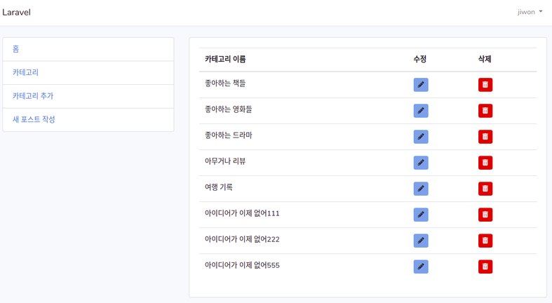

# Categories CRUD

## Edit

1. Edit button 추가  
> views/admin/categories/index.blade.php
```php
            <td>
              <a class="btn btn-sm btn-info" href="{{ route('category.edit', ['id' => $category->id ]) }}">
                <span><i class="fas fa-pencil-alt"></i></span>
              </a>
            </td>
```
강의에서는 glythcon을 쓰는데 bootstrap4에서는 안쓰기때문에 font-awesome cdn을
app.blade.php에 추가하고 font-awesome icon으로 변경함

2. edit route 추가  
edit은 특정한 category를 수정하는 것이므로 'id'를 매개변수로 받아야 한다.  
> routes/web.php
```php
  Route::get('/category/edit/{id}', [
    'uses' => 'CategoriesController@edit',
    'as'   => 'category.edit'
  ]);
```

아 ㅅㅂ 짜증나게;; edit 작성하다말고 갑자기 왜 delete 만들고있냐...

3. delete button추가  
> views/admin/categories/index.blade.php
```php
            <td>
              <a class="btn btn-sm btn-danger" href="{{ route('category.delete', ['id' => $category->id ]) }}">
                <span><i class="fas fa-trash-alt"></i></span>
              </a>
            </td>
```
4. delete route 추가  
> routes/web.php
```php
  Route::get('/category/delete/{id}', [
    'uses' => 'CategoriesController@destroy',
    'as'   => 'category.delete'
  ]);
```

5. edit view 작성  
create.blade.php를 복사해서 
> resources/views/admin/categories/edit.blade.php 생성  

6. edit method 작성  
> app/Http/Controllers/CategoriesController.php
```php
    public function edit($id)
    {
      $category = Category::find($id);

      return view('admin.categories.edit')->with('category', $category); 
    }
```
7. edit view 수정  

- 공통되는 error를 따로 파일로 빼냄  

먼저 admin 아래에 'includes'라는 폴더를 만듬  
그리고 errors.blade.php 파일을 생성  
여기에 공통되는 에러 처리 부분을 잘라내서 붙인다.  
```php
  @if(count($errors) > 0)
    <ul class="list-group">

      @foreach($errors->all() as $error)
        <li class="list-group-item text-danger">
          {{ $error }}
        </li>
      @endforeach
    </ul>
  @endif
```
- edit 에 error처리파일 include
> resources/views/admin/categories/edit.blade.php 
```php
// 원래 error처리 부분에 error 파일을 include
  @include('admin.includes.error')
```
create, index등 다른 파일에도 에러처리 부분을 include한다.  

- edit 수정 계속...
```php
  <div class="card">
    <div class="card-header">
      카테고리 수정 : {{ $category->name }}
    </div>
    
    <div class="card-body">
      <form action="{{ route('category.update', ['id' => $category->id ]) }}" method="post">
        {{ csrf_field() }}
        <div class="form-group">
          <label for="name">카테고리 이름</label>
          <input class="form-control" type="text" name="name" value="{{ $category->name }}">
        </div>

        <div class="form-group">
          <div class="text-center">
            <button class="btn btn-success" type="submit">수정완료</button>
          </div>
```
8. update route 작성  
> web.php
```php
  Route::post('/category/update/{id}', [
    'uses' => 'CategoriesController@update',
    'as'   => 'category.update'
  ]);
```
9. update method 작성  
> CategoriesController.php
```php
    public function update(Request $request, $id)
    {
      $category = Category::find($id);
      $category->name = $request->name;
      $category->save();

      return redirect()->route('categories'); 
    }
```
10. delete method 작성  
> CategoriesController.php
```php
    public function destroy($id)
    {
      $category = Category::find($id);
      $category->delete();

      return redirect()->route('categories');
    }
```

이제 카테고리 추가부터 수정, 삭제가 모두 잘 되는 것을 확인할 수 있다.  
  


