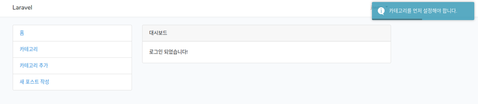

## Setting session infomation  

포스트를 작성하러 들어가면, 아직 카테고리가 없어서 아무런 카테고리를 선택할 수가
없다. 그러므로 카테고리가 먼저 있게끔 해야한다.  

1. PostsController 수정  
> PostsController.php
```php
    public function create()
    {
      $categories = Category::all();

      if ($categories->count() === 0)
      {
        Session::flash('info', '카테고리를 먼저 만들어야 합니다.');

        return redirect()->back();
      }

      return view('admin.posts.create')->with('categories', Category::all());
    }
```
2. view 수정  
toastr에 info를 추가 
> resources/views/layouts/app.blade.php
```php
@if(Session::has('info'))
  toastr.info("{{ Session::get('info') }}")
@endif
```
이제 포스트를 작성하려고 할때 카테고리가 없으면 다음과 같이 카테고리를 먼저
설정하라고 뜬다.  
  

---

## Slugs

슬러그는 URL의 일부분 (전부는 아니지만)이다. 일반적으로 슬러그는 SEO 친숙한 URL이 포럼 게시물, 제품 페이지 등을 가리키는 데 사용된다. 
[슬러그 설명 링크](https://laracasts.com/discuss/channels/laravel/what-exactly-is-a-slug)  

1. Post model에서 slug를 fillable에 추가  
> app/Post.php
```php
  protected $fillable = [
      'title', 'featured', 'content', 'category_id', 'slug'
  ];
```
2. PostsController에서 slug추가  
> app/Http/Controllers/PostsController.php
```php
      $post = Post::create([
        'title'       => $request->title,
        'content'     => $request->content,
        'featured'    => 'uploads/posts/'.$featured_new_name,
        'category_id' => $request->category_id,
        'slug'        => str_slug($request->title)
      ]);
```
- die and dump 대신 redirect back 넣기  
```php
      return redirect()->back();
```
3. slug가 어떻게 생성되는지 포스트를 작성해서 확인  
```bash
vagrant@homestead:~/code/blog$ php artisan tinker  
Psy Shell v0.9.9 (PHP 7.2.9-1+ubuntu18.04.1+deb.sury.org+1 — cli) by Justin Hileman                   
>>> App\Post::all();                               
=> Illuminate\Database\Eloquent\Collection {#2942                                                     
     all: [                                                                                           
       App\Post {#2943                                                                                
         id: 1,                                                                                       
         category_id: 1,                                                                              
         slug: "1",                                                                                   
         title: "새로운 포스트1",                                                                     
         content: "$fillable는 대량 할당(mass assign)될 수 있는 속성들의 화이트 리스트로써 동작 하지만, $guarded를 사용할 수도 있습니다. $guarded 속성은 대량 할당(mass assign)하고 싶지 않은 속성들의 배열을
 가지고 있을 것입니다. 이 배열에 포함되지 않은 모든 속성들은 대량 할당될 수 있을 것입니다. 따라서 $guarded는 블랙리스트와 같은 기능을 합니다. 물론 $fillable나 $guarded 둘 중 하나만을 사용해야 합니다. 다음 
예제에서 price를 제외한 모든 속성들은 대량 할당이 가능합니다",                                        
         featured: "uploads/posts/1541318077t-pride.png",                                             
         deleted_at: null,                                                                            
         created_at: "2018-11-04 07:54:37",                                                           
         updated_at: "2018-11-04 07:54:37",                                                           
       },                                          
       App\Post {#2944                             
         id: 2,                                    
         category_id: 1,                                                                              
         slug: "new-laravel-post1",                
         title: "new laravel post1",               
         content: "$fillable는 대량 할당(mass assign)될 수 있는 속성들의 화이트 리스트로써 동작 하지만, $guarded를 사용할 수도 있습니다. $guarded 속성은 대량 할당(mass assign)하고 싶지 않은 속성들의 배열을
 가지고 있을 것입니다. 이 배열에 포함되지 않은 모든 속성들은 대량 할당될 수 있을 것입니다. 따라서 $guarded는 블랙리스트와 같은 기능을 합니다. 물론 $fillable나 $guarded 둘 중 하나만을 사용해야 합니다. 다음 
예제에서 price를 제외한 모든 속성들은 대량 할당이 가능합니다:",                                       
         featured: "uploads/posts/1541318213t-pride.png",                                             
         deleted_at: null,                         
         created_at: "2018-11-04 07:56:53",        
         updated_at: "2018-11-04 07:56:53",                                                                                                                                                                  
       },                                                                                                                                                                                                    
     ],                                                                                               
   }                      
```
보다시피 한글은 slug처리가 안되고 영문만 된다.  
찾아보니 non-ascii string은 처리가 안된다고 나와있다.  

[해결책](https://stackoverflow.com/questions/38800581/laravel-str-slug-not-working-for-unicode-bangla/38800717)  

4. PostsController에 slug helper를 작성해서 넣음  
> PostsController.php
```php
      /*
       * helper slug
       */
      function make_slug($str) {
        return preg_replace('/\s+/u', '-', trim($str));
      }

      $post = Post::create([
        'title'       => $request->title,
        'content'     => $request->content,
        'featured'    => 'uploads/posts/'.$featured_new_name,
        'category_id' => $request->category_id,
        'slug'        => make_slug($request->title)
      ]);
```
일단 이걸로 해결... helper를 다른데로 옮겨서 공통으로 사용해야 하는데 그거는
진행하면서 알아보자.  

