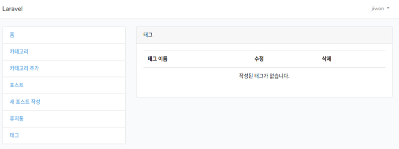

## Tags의 사용 

#### 1. 먼저 tags table을 만들자.  

- tag model 생성 
```bash
vagrant@homestead:~/code/blog$ php artisan make:model Tag -m
Model created successfully.
Created Migration: 2018_11_04_145029_create_tags_table
```
- 생성된 파일 수정  
tag 필드를 추가한다.
> 2018_11_04_145029_create_tags_table.php
```php
    public function up()
    {
        Schema::create('tags', function (Blueprint $table) {
            $table->increments('id');
            $table->string('tag');
            $table->timestamps();
        });
    }
```
#### 2. posts와 Tag를 연관시켜야 한다.  

여기에서 등장하는 개념이 'Many to Many relationships'(다 대 다 관계)이다.  

One to Many(일대다)관계에서, 하나의 카테고리는 여러개의 포스트를 가질 수 있고,  
                             하나의 포스트는 하나의 카테고리에만 속할 수 있었다.  

지금 여기에서는
포스트는 여러개의 태그를 가질 수 있고, 
태그 역시 여러개의 포스트에 속할 수 있다.  

- 관계 정의  
> Tag.php
```php
class Tag extends Model
{
  public function posts() {
    return $this->belongsToMany('App\Post');
  }
}
```
'Tag'모델이 여러개의 'Post'모델에 속한다는 정의를 한 셈이다.  

> Post.php
```php
  public function tags() {
    return $this->belongsToMany('App\Tag');
  }
```
'Post'모델 역시 여러개의 'Tag'모델에 속한다는 정의를 해 주었다.  

#### 3. Pivot Table 
이제 2번에서 정의한 두개의 모델을 pivot table을 사용해서 따라갈 수 있다.  
Pivot table을 사용하면 tag와 post 테이블간의 관계를 파악할 수 있다.  

- pivot table 만들기  
php artisan을 사용하면 되는데, pivot table이름을 위한 규칙이 있다.  

1) 두 테이블의 이름을 단수로 취한다.  
2) 두 테이블의 이름을 알파벳 순으로 적는다.  
3) 두 테이블의 이름 사이는 밑줄로 잇는다.  

해서 다음과 같은 명령어로 만들 수 있다.  
```bash
vagrant@homestead:~/code/blog$ php artisan make:Migration create_post_tag_table
Created Migration: 2018_11_04_150519_create_post_tag_table
```

- 만들어진 migration file수정  
post_id와 tag_id라는 필드를 추가 
> 2018_11_04_150519_create_post_tag_table.php
```php
    public function up()
    {
        Schema::create('post_tag', function (Blueprint $table) {
            $table->increments('id');
            $table->integer('post_id');
            $table->integer('tag_id');
            $table->timestamps();
        });
    }
```
- migration 실행  
```bash
vagrant@homestead:~/code/blog$ php artisan migrate 
Migrating: 2018_11_04_145029_create_tags_table
Migrated:  2018_11_04_145029_create_tags_table
Migrating: 2018_11_04_150519_create_post_tag_table
Migrated:  2018_11_04_150519_create_post_tag_table
```
---

## Tag를 위한 CRUD 작성  

#### 1. Tag 필드를 fillable하게  
> Tag.php
```php
  protected $fillable = ['tag'];
```

#### 2. tag controller 생성  
```bash
vagrant@homestead:~/code/blog$ php artisan make:controller TagsController --resource
Controller created successfully.
```

#### 3. TagsController

- index
> TagsController.php
```php
use Session;
use App\Tag;
...
    public function index()
    {
      return view('admin.tags.index')->with('tags', Tag::all());
    }
```
- create
> TagsController.php
```php
    public function store(Request $request)
    {
      Tag::create([
        'tag' => $request->tag
      ]);

      Session::flash('success', '태그가 성공적으로 작성되었습니다.');

      return redirect()->route('tags');
    }
```
validation을 추가  
```php
      $this->validate($request, [
        'tag' => 'required'
      ]);
```
- edit  
```php
    public function edit($id)
    {
      $tag = Tag::find($id);

      return view('admin.tags.edit')->with('tag', $tag);
    }
```
- update
```php
    public function update(Request $request, $id)
    {
      $this->validate($request, [
        'tag' => 'required'
      ]);

      $tag = Tag::find($id);
      $tag->tag = $request->tag;
      $tag->save();

      Session::flash('success', '태그가 업데이트 되었습니다.');

      return redirect()->route('tags');
    }
```
- destroy
```php
    public function destroy($id)
    {
      Tag::destroy($id);

      Session::flash('success', '태그가 삭제되었습니다.');

      return redirect()->route('tags');
    }
```
#### 4. tags view

- resources/views/admin아래에 'tags'폴더를 만든다.  

- categories의 index.blade.php를 복사해서 tags 밑에도 같은 파일을 만들고,  
  create와 edit도 똑같이 만든다.  

- index 파일 수정  
> resources/views/admin/tags/index.php
적당히 내용을 tag에 맞게 고친다.


#### 5. route 추가  
> web.php
```php
  Route::get('/tags', [
    'uses' => 'TagsController@index',
    'as'   => 'tags'
  ]);

  Route::get('/tag/edit/{id}', [
    'uses' => 'TagsController@edit',
    'as'   => 'tag.edit'
  ]);

  Route::post('/tag/update/{id}', [
    'uses' => 'TagsController@update',
    'as'   => 'tag.update'
  ]);

  Route::get('/tag/delete/{id}', [
    'uses' => 'TagsController@delete',
    'as'   => 'tag.delete'
  ]);
```

#### 6. app에 tag링크 추가  
> resources/views/layouts/app.blade.php
```php
                  <li class="list-group-item">
                    <a href="{{ route('tags') }}">태그</a>
                  </li>
```
여기까지 했을 때의 화면은 다음과 같다.  
  


#### 7. create tag 
> resources/views/admin/tags/create.blade.php
이것도 적당히 태그에맞게 내용을 수정한다.  

- 태그를 새로 추가하는 링크를 추가  
> app.blade.php
```php
                  <li class="list-group-item">
                    <a href="{{ route('tag.create') }}">새 태그 작성</a>
                  </li>
```
- create route, store route 추가  
> web.php
```php
  Route::get('/tag/create', [
    'uses' => 'TagsController@create',
    'as'   => 'tag.create'
  ]);

  Route::post('/tag/store', [
    'uses' => 'TagsController@store',
    'as'   => 'tag.store'
  ]);
```

- create method 추가  
> TagsController.php
```php
    public function create()
    {
      return view('admin.tags.create');
    }
```

