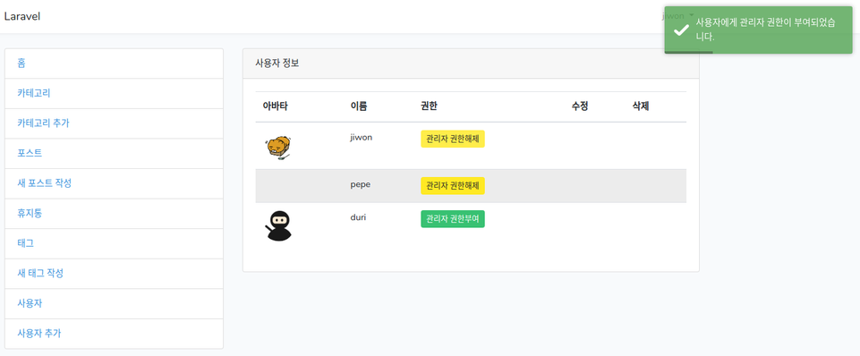

## Permissions

### 기본 아바타 만들기  

1. controller 수정
> UsersController.php
```php
      $profile = Profile::create([
        'user_id' => $user->id,
        'avatar'  => 'uploads/avatars/default.png'
      ]); 
```

### 권한  

사용자에게 admin 권한을 줄 수 있는 버튼을 만든다.  
1. view 수정  
> resources/views/admin/users/index.blade.php
```php
            <td>
              @if($user->admin)
                admin
              @else
                <a class="btn btn-sm btn-success" href="{{ route('user.admin') }}">관리자 권한부여</a>
              @endif
            </td>
```

2. route 추가  
> web.php
```php
  Route::get('/user/admin', [
    'uses' => 'UsersController@admin',
    'as'   => 'user.admin'
  ]);
```

3. admin method 추가  
> UsersController.php
```php
    public function admin($id)
    {
      $user = User::find($id);
      $user->admin = 1;
      $user->save();

      Session::flash('success', '사용자에게 관리자 권한이 부여되었습니다.');

      return redirect()->route('users');
    }
```
4. 만드는 김에 not admin method도 추가   
> UsersController.php
```php
    public function not_admin($id)
    {
      $user = User::find($id);
      $user->admin = 0;
      $user->save();

      Session::flash('success', '사용자의 관리자 권한이 해제되었습니다.');

      return redirect()->route('users');
    }
```
5. route도 추가  
> web.php
```php
  Route::get('/user/not-admin/{id}', [
    'uses' => 'UsersController@not_admin',
    'as'   => 'user.not.admin'
  ]);
```

이제 브라우저에서 확인하면 권한 설정, 해제가 가능하다.

  

-----

### Middleware

현재는 관리자 권한이 없어도 로그인해서 모든 메뉴로 접근이 가능함과 동시에 심지어 
스스로를 관리자로 만들 수도 있다. 이것을 수정하기 위해 Middleware를 사용할
것이다.  

1. middleware 만들기  
```bash
vagrant@homestead:~/code/blog$ php artisan make:middleware Admin
Middleware created successfully.
```
2. Middleware 수정  
> app/Http/Middleware/Admin.php
```php
use Auth;
use Session;
...

    public function handle($request, Closure $next)
    {
      if(!Auth::user()->admin)
      {
        Session::flash('info', '권한이 없습니다.');
        return redirect()->route('home');
      }
        return $next($request);
    }
```
3. Middleware를 등록  
> app/Http/Kernel.php
```php
    protected $routeMiddleware = [
...
        'admin' => \App\Http\Middleware\Admin::class,
```
4. route 수정  
> web.php
```php
  Route::get('/user/admin/{id}', [
    'uses' => 'UsersController@admin',
    'as'   => 'user.admin'
  ])->middleware('admin');
```
5. admin Middleware를 UsersController에 넣기  
> UsersController.php
```php
    public function __construct()
    {
      $this->middleware('admin');
    }
```
그리고 web.php에서는 4번에서 추가했던 내용을 제외시킨다.  

이렇게 하고 다른 사용자(관리자 권한이 없는)로 로그인해서 확인해보면 
'사용자','사용자 추가'메뉴에는 접근이 불가하고, 권한이 없다는 메시지가 뜬다.  

6. 권한이 없으면 아예 메뉴도 보이지 않게하기  
- 메뉴 앞에 if문으로 조건 추가  
> resources/views/layouts/app.blade.php
```php
                  @if(Auth::user()->admin)
                    <li class="list-group-item">
                      <a href="{{ route('users') }}">사용자</a>
                    </li>

                    <li class="list-group-item">
                      <a href="{{ route('user.create') }}">사용자 추가</a>
                    </li>
                  @endif
```

### 사용자 프로필 수정  

1. controller 생성  
```bash
vagrant@homestead:~/code/blog$ php artisan make:controller ProfilesController --resource
Controller created successfully.
```
2. controller 내용 수정  
> ProfilesController.php
```php
use Auth;
...
    public function index()
    {
      return view('admin.users.profile')->with('user', Auth::user());
    }
```
3. view 생성  
resources/views/admin/users 아래에 profile.blade.php 생성  
create.blade.php를 복사해서 만든 후, 내용을 수정  
```php
<div class="card">
  <div class="card-header">
    사용자 정보 수정
  </div>
  
  <div class="card-body">
    <form action="{{ route('user.profile.update') }}" method="post">
      {{ csrf_field() }}
      <div class="form-group">
        <label for="name">사용자 이름</label>
        <input class="form-control" type="text" name="name">
      </div>

      <div class="form-group">
        <label for="email">E-mail</label>
        <input class="form-control" type="email" name="email">
      </div>

      <div class="form-group">
        <label for="password">비밀번호</label>
        <input class="form-control" type="text" name="password">
      </div>

      <div class="form-group">
        <label for="avatar">아바타</label>
        <input class="form-control" type="file" name="avatar">
      </div>

      <div class="form-group">
        <label for="about">소개</label>
        <textarea id="about" class="form-control" name="about" cols="6" rows="6"></textarea>
      </div>

      <div class="form-group">
        <label for="facebook">facebook</label>
        <input class="form-control" type="text" name="facebook">
      </div>

      <div class="form-group">
        <label for="youtube">YouTube</label>
        <input class="form-control" type="text" name="youtube">
      </div>

      <div class="form-group">
        <div class="text-center">
          <button class="btn btn-success" type="submit">수정완료</button>
        </div>
      </div>
```

4. route 추가  
> web.php
```php
  Route::get('/user/profile', [
    'uses' => 'ProfilesController@index',
    'as'   => 'user.profile'
  ]);

  Route::get('/user/profile/update', [
    'uses' => 'ProfilesController@update',
    'as'   => 'user.profile.update'
  ]);
```
5. view 추가  
> resources/views/layouts/app.blade.php
```php
                    <li class="list-group-item">
                      <a href="{{ route('user.profile') }}">내 정보 수정</a>
                    </li>
```
6. profile view 수정  
- 원래 값이 출력되도록 수정  
- form에 'enctype' 추가하는 것을 잊지 말것 
> resources/views/admin/users/profile.blade.php
```php
  <div class="card-body">
    <form action="{{ route('user.profile.update') }}" method="post" enctype="multipart/form-data">
      {{ csrf_field() }}
      <div class="form-group">
        <label for="name">사용자 이름</label>
        <input class="form-control" type="text" name="name" value="{{ $user->name }}">
      </div>

      <div class="form-group">
        <label for="email">E-mail</label>
        <input class="form-control" type="email" name="email" value="{{ $user->email }}">
      </div>
...
      <div class="form-group">
        <label for="about">소개</label>
        <textarea id="about" class="form-control" name="about" cols="6" rows="6">{{ $user->profile->about }}</textarea>
      </div>

      <div class="form-group">
        <label for="facebook">facebook</label>
        <input class="form-control" type="text" name="facebook" value="{{ $user->profile->facebook }}">
      </div>

      <div class="form-group">
        <label for="youtube">YouTube</label>
        <input class="form-control" type="text" name="youtube" value="{{ $user->profile->youtube }}">
      </div>
```
이제 기존 정보가 불러와지도록 변경되었다.  

-----

### 사용자 프로필 수정 계속...

1. controller 수정  
> ProfilesController.php
```php
    public function update(Request $request)
    {
       $this->validate($request, [
          'name'     => 'required',
          'email'    => 'required|email',
          'facebook' => 'required|url',
          'youtube'  => 'required|url',
        ]);

       $user = Auth::user();

       if ($request->hasFile('avatar')) {
         $avatar = $request->avatar;
         $avatar_new_name = time().$avatar->getClientOriginalName();
         $avatar->move('uploads/avatars', $avatar_new_name);
         $user->profile->avatar = 'uploads/avatars/'.$avatar_new_name;
         $user->profile->save();
      }

       $user->name = $request->name;
       $user->email = $request->email;
       $user->profile->facebook = $request->facebook;
       $user->profile->youtube = $request->youtube;

       $user->save();
       $user->profile->save();

       if ($request->has('password')) {
          $user->password = bcrypt($request->password);
          $user->save();
        }

       Session::flash('success', '정보가 성공적으로 변경되었습니다.');

       return redirect()->back();
    }
```
-----

### 사용자 삭제  

1. controller 수정  
> UsersController.php
```php
    public function destroy($id)
    {
      $user = User::find($id);
      $user->profile->delete();
      $user->delete();

      Session::flash('success', '사용자가 삭제되었습니다.');

      return redirect()->back();
    }
```

2. route 추가  
> web.php
```php
  Route::get('/user/delete/{id}', [
    'uses' => 'UsersController@destroy',
    'as'   => 'user.delete'
  ]);
```

3. index view 수정  
- 권한이 있어야 삭제할수 있도록 만듬... 
> resources/views/admin/users/index.blade.php
```php
            <td><!-- 삭제 -->
              @if (Auth::id() === $user->id)
              <a class="btn btn-sm btn-danger" href="{{ route('user.delete', ['id' => $user->id ]) }}">
                <span><i class="fas fa-trash-alt"></i></span>
              </a>
              @endif
            </td>
```
근데 어차피 사용자 목록 페이지가 admin한테만 접근이 허락되는건데 저 조건이
의미가 있나..차라리 사용자가 admin인지 체크하는 걸로 바꾸는게 맞는것 같다.  
그리고 softdelete도 적용해야할듯.. 

4. 그래서 admin일때 삭제
> resources/views/admin/users/index.blade.php
```php
              @if (Auth::user()->admin)
              <a class="btn btn-sm btn-danger" href="{{ route('user.delete', ['id' => $user->id ]) }}">
                <span><i class="fas fa-trash-alt"></i></span>
              </a>
              @endif
```


-----

### category 삭제 할때 관련 포스트 지우기  

1. controller 수정  
> app/Http/Controllers/CategoriesController.php
```php
    public function destroy($id)
    {
      $category = Category::find($id);

      foreach($category->posts as $post) {
        $post->delete();
  //    $post->forceDelete();
      }

      $category->delete();

      Session::flash('success', '카테고리가 성공적으로 삭제되었습니다.');

      return redirect()->route('categories');
    }
```
-----

### 태그가 하나도 없을때 메시지 띄우기 

1. controller 수정  
> app/Http/Controllers/PostsController.php
```php
    public function create()
    {
      $categories = Category::all();
      $tags = Tag::all();

      if ($categories->count() === 0 || $tags->count() === 0)
      {
        Session::flash('info', '카테고리, 태그를 먼저 만들어야 합니다.');

        return redirect()->back();
      }

      return view('admin.posts.create')->with('categories', $categories)
                                       ->with('tags', $tags);
    }
```

### 현재까지의 문제점 

1. 관리자 권한일때 사용자 수정  
- 사용자 수정 안됨.. 사용자 수정 메뉴를 연결하면 본인 프로필 수정밖에 안되서
연결해보려다가 실패함.  

2. softdelete 연결해야함.
- 현재 사용자 삭제하면 그냥 삭제되는데, softdelete를 연결해야함.


