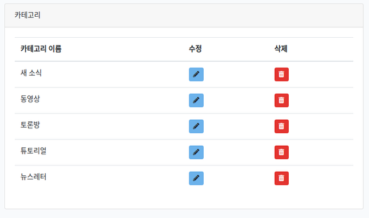

### theme 셋업  

1. 압축을 푼 폴더에서 app폴더를 통째로 public 아래에 복사   

2. home.html을 복사해서 welcome.blade.php에 붙여넣기  

3. welcome.blade.php에서 app/css와 app/js를 ``{{ asset() }}``으로 옮기기  
- 그리고 img file도 똑같이 옮긴다. 
- vim에서 변환
```bash
:%s/\(app.*css\)/{{ asset\(\'\1\'\) }}/cg
:%s/\(app.*js\)/{{ asset\(\'\1\'\) }}/cg

:%s/\(app.*png\)/{{ asset\(\'\1\'\) }}/cg
:%s/\(app.*jpg\)/{{ asset\(\'\1\'\) }}/cg
```

### 데이터를 dynamic하게 출력하기  

1. welcome page에서 header 부분을 잘라내고 다음을 삽입  
```php
// 잘라낸 헤더 부분 
    <header class="header" id="site-header">
        <div class="container">
                <div class="header-content-wrapper">
                    <div class="logo">
                        <div class="logo-text">
                            <div class="logo-title">LARAVEL'S BLOG</div>
                        </div>
                    </div>

                    <nav id="primary-menu" class="primary-menu">
                        <a href='javascript:void(0)' id="menu-icon-trigger" class="menu-icon-trigger showhide">
                            <span id="menu-icon-wrapper" class="menu-icon-wrapper" style="visibility: hidden">
                                <svg width="1000px" height="1000px">
                                    <path id="pathD" d="M 300 400 L 700 400 C 900 400 900 750 600 850 A 400 400 0 0 1 200 200 L 800 800"></path>
                                    <path id="pathE" d="M 300 500 L 700 500"></path>
                                    <path id="pathF" d="M 700 600 L 300 600 C 100 600 100 200 400 150 A 400 380 0 1 1 200 800 L 800 200"></path>
                                </svg>
                            </span>
                        </a>
                        <ul class="primary-menu-menu" style="overflow: hidden;">
                            <li class="">
                                <a href="">NEWS</a>
                            </li>
                            <li class="">
                                <a href="">VIDEOS</a>
                            </li>
                            <li class="">
                                <a href="">DISCUSSIONS</a>
                            </li>
                            <li class="">
                                <a href="">TUTORIALS</a>
                            </li>
                            <li class="">
                                <a href="">NEWSLETTER</a>
                            </li>
                        </ul>
                    </nav>
                    <ul class="nav-add">
                        <li class="search search_main" style="color: black; margin-top: 5px;">
                            <a href="#" class="js-open-search">
                                <i class="seoicon-loupe"></i>
                            </a>
                        </li>
                    </ul>
                </div>
        </div>
    </header>

// 잘라내고 다음을 삽입
@include('includes.header')
```
2. resources/views아래에 includes 폴더 만들고 header.blade.php 파일 생성  
- 그리고 잘라낸 헤더부분을 붙여넣기함  

----

### Dynamic content display 1
#### 타이틀

1. frontend controller 생성  
```bash
vagrant@homestead:~/code/blog$ php artisan make:controller FrontEndController
Controller created successfully.
```

2. home route 변경  
> web.php
```php
Route::get('/', function () {
    return view('welcome');
});
```
원래 이 내용을 지우고 아래내용으로 변경  
```php
Route::get('/', [
  'uses'  => 'FrontEndController@index',
  'as'    => 'index'
]);
```
3. controller 수정  
> FrontEndController.php
```php
  public function index()
  {
    return view('index');
  }
```
4. welcome.blade.php를 index.blade.php로 변경

5. 브라우저에서 잘 뜨는지 확인함 --> 이상없음 

6. controller에 데이터 전달  
> FrontEndController.php
```php
use App\Setting;
...

  public function index()
  {
    return view('index')->with('title', Setting::first()->site_name);
  }
```
7. index view 수정  
- site_name을 page의 title에 표시
> resources/views/index.blade.php
```php
    <title>{{ $title }}</title>
```
- site_name을 site의 title에 표시  
> resources/views/includes/header.blade.php
```php
                        <div class="logo-text">
                            <div class="logo-title">{{ $title }}</div>
                        </div>
```

#### 카테고리 

1. admin page에서 카테고리를 만들고  
  

2. controller에 카테고리 데이터 전달  
> FrontEndController.php
```php
use App\Category;
...
  public function index()
  {
    return view('index')->with('title', Setting::first()->site_name)
                        ->with('categories', Category::all());
  }
```
- 만약 카테고리가 10개고 그 중 4개만 표시하고 싶다면?  
```php
  public function index()
  {
    return view('index')->with('title', Setting::first()->site_name)
                        ->with('categories', Category::take(4)->get());
  }
```
3. header view 수정  
> resources/views/includes/header.blade.php
```php
                        <ul class="primary-menu-menu" style="overflow: hidden;">
                        @foreach ($categories as $category) 
                            <li class="">
                                <a href="">{{ $category->name }}</a>
                            </li>
                        @endforeach
                        </ul>
```
----

#### 포스트  

1. controller에 post 데이터 전달  
> FrontEndController.php
```php
                        ->with('first_post', Post::orderBy('created_at', 'desc')->first());
```
2. index view 수정  
> resources/views/index.blade.php
```php

                        <div class="post-thumb">
                            featured }}" alt="{{ $first_post->title }}">
                            <div class="overlay"></div>
                            <a href="{{ $first_post->featured }}" class="link-image js-zoom-image">
                                <i class="seoicon-zoom"></i>
                            </a>
                            ...
                                    <h2 class="post__title entry-title ">
                                        <a href="15_blog_details.html">{{ $first_post->title }}</a>
                                    </h2>

                                    <div class="post-additional-info">

                                        <span class="post__date">

                                            <i class="seoicon-clock"></i>

                                            <time class="published" datetime="2016-04-17 12:00:00">
                                              {{ $first_post->created_at }}
                                            </time>

                                        </span>
```
3. timestamp에 diffForHumans 적용하기  
> resources/views/index.blade.php
```php
                                            <time class="published" datetime="2016-04-17 12:00:00">
                                                 {{ $first_post->created_at->diffForHumans() }}
                                            </time>
```
이렇게 적용하면 10minutes ago 하는 식으로 시간이 표시됨  

4. category 표시  
> resources/views/index.blade.php
```php
                                        <span class="category">
                                            <i class="seoicon-tags"></i>
                                            <a href="#">{{ $first_post->category->name }}</a>
                                        </span>
```


