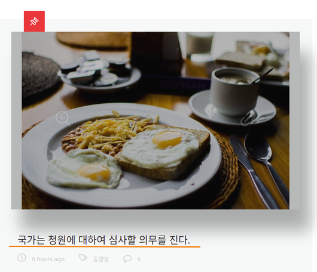
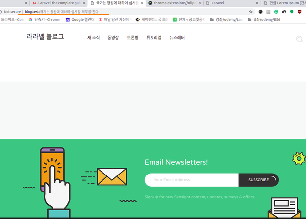
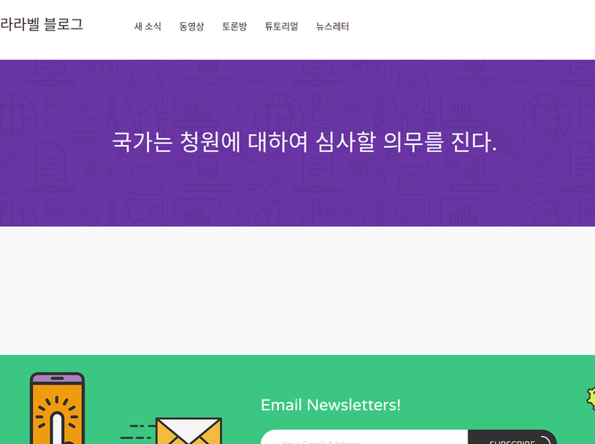

### front layout과 single page 만들기  

1. resources/views/layouts 아래에 frontend.blade.php 파일 만들기  
- index.blade.php 파일을 복사해서 생성  
- 그리고 내용을 좀 정리함... 대체적으로 삭제


2. resources/views 아래에 single.blade.php 파일 생성  
> single.blade.php
```php
@extends('layouts.frontend')
```

3. route 추가  
> web.php
```php
Route::get('/{slug}', [
  'uses'  => 'FrontEndController@singlePost',
  'as'    => 'post.single'
]);
```

4. method 추가  
> FrontEndController.php
```php
  public function singlePost($slug) 
  {
    $post = Post::where('slug', $slug)->first();

    return view('single')->with('post', $post)
                         ->with('title', $post->title)
                         ->with('categories', Category::all())
                         ->with('settings', Setting::first());
  }
```

5. header view 수정  
- title이 아니라 site_name으로 수정  
> header.blade.php
```php
                        <div class="logo-text">
                            <div class="logo-title">{{ $settings->site_name }}</div>
                        </div>
```

6. index view에 single page로 링크 걸기  
> index.blade.php
```php
                                    <h2 class="post__title entry-title ">
                                        <a href="{{ route('post.single', ['slug' => $first_post->slug ]) }}">{{ $first_post->title }}</a>
                                    </h2>
```
  
7. 브라우저에서 확인  

  
  

---

### Single post의 content 넣기  

#### 타이틀 넣기 
1. single view 수정  
single.html에서 header부분 복사해서 붙여넣기 한 다음 타이틀 부분 고치기 
> resources/views/single.blade.php
```php
@extends('layouts.frontend')

@section('content')  

<!-- Stunning Header -->
<div class="stunning-header stunning-header-bg-lightviolet">
    <div class="stunning-header-content">
        <h2 class="stunning-header-title">{{ $post->title }}</h2>
        // 이거는 내가 임의로 h2로 줄였음 
    </div>
</div>
<!-- End Stunning Header -->

@endsection
```

2. frontend view 수정  
> frontend.blade.php
```php
<div class="content-wrapper">
    
    <!-- header -->
    @include('includes.header')

    @yield('content') 
```
  


#### 포스트 내용 불러오기  

1. view 수정  
single.html에서 content 부분 복사해서 붙여넣기  
> single.blade.php
```php
<!-- Post Details -->
<!-- End Post Details -->

            <!-- Sidebar-->
            <!-- End Sidebar-->

이 부분 전부 붙여넣기 
```

2. single view 수정  
> single.blade.php
```php
                        featured }}" alt="seo">

                      ...

                                <div class="post__author-name fn">
                                    <a href="#" class="post__author-link">Admin</a>
                                </div>
        --> 이 부분은 나중에 {{ $post->user->name }} 식으로 수정해야함
        ...

                        <div class="post__content-info">
                        
                          {!! $post->content !!}
```
``{!!  !!}``부분은, 우리의 포스트 content가 WYSIWYG로 작성되었기 때문에 그것을
html로 표출하기 위해서 그 안에 넣어준다.  

3. tag를 표시  
> single.blade.php
```php
                            <div class="widget w-tags">
                                <div class="tags-wrap">
                                    @foreach($post->tags as $tag)
                                    <a href="#" class="w-tags-item">{{ $tag->tag }}</a>
                                    @endforeach
                                </div>
                            </div>
```


