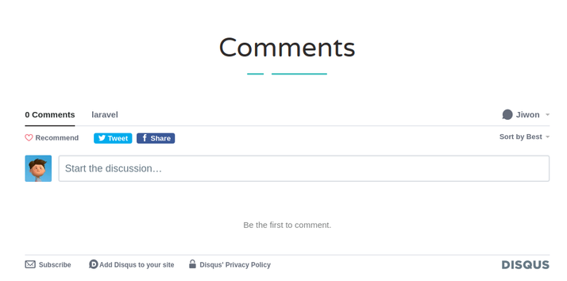

### disqus 

Disqus는 commenting platform으로 이것이 설치된 곳에는 social login이나
disqus계정으로 로그인해서 코멘트를 남길 수 있다.  

[link](https://disqus.com/)  

1. disqus에서 안내하는 코드를 복사  
```php
<div id="disqus_thread"></div>
<script>

/**
*  RECOMMENDED CONFIGURATION VARIABLES: EDIT AND UNCOMMENT THE SECTION BELOW TO INSERT DYNAMIC VALUES FROM YOUR PLATFORM OR CMS.
*  LEARN WHY DEFINING THESE VARIABLES IS IMPORTANT: https://disqus.com/admin/universalcode/#configuration-variables*/
/*
var disqus_config = function () {
this.page.url = PAGE_URL;  // Replace PAGE_URL with your page's canonical URL variable
this.page.identifier = PAGE_IDENTIFIER; // Replace PAGE_IDENTIFIER with your page's unique identifier variable
};
*/
(function() { // DON'T EDIT BELOW THIS LINE
var d = document, s = d.createElement('script');
s.src = 'https://laravel-mejzurdq00.disqus.com/embed.js';
s.setAttribute('data-timestamp', +new Date());
(d.head || d.body).appendChild(s);
})();
</script>
<noscript>Please enable JavaScript to view the <a href="https://disqus.com/?ref_noscript">comments powered by Disqus.</a></noscript>
```
2. disqus를 표시할 view 수정  
> single.blade.php
```php
                <div class="comments">

                    <div class="heading text-center">
                        <h4 class="h1 heading-title">Comments</h4>
                        <div class="heading-line">
                            <span class="short-line"></span>
                            <span class="long-line"></span>
                        </div>
                    </div>
                </div>

                @include('includes.disqus')
```
3. disqus view 생성  
- resources/views/includes 밑에 disqus.blade.php 생성  
- 그리고 1번에서 복사한 코드를 붙여넣기  

- 주석처리 부분을 주석해제 한 다음 'PAGE_URL', 'PAGE_IDENTIFIER'를 dynamic하게
작성  
> disqus.blade.php
```php
var disqus_config = function () {
  this.page.url = "{{ route('post.single', ['slug' => $post->slug ]) }}";  // Replace PAGE_URL with your page's canonical URL variable
  this.page.identifier = "post-{{ $post->slug }}"; // Replace PAGE_IDENTIFIER with your page's unique identifier variable
};
```
이제 disqus comment 시스템이 설치되었다.  

  

#### 문제점 - comment하고 다음 all blog tags 사이의 간격을 벌리려고 하는데 br 태그도 안먹고 p 태그로도 간격이 안벌어짐...

---

### 모든 tag 표시  

1. controller에 데이터 전달  
> FrontEndController.php
```php
use App\Tag;
...
                         ->with('tags', Tag::all());
```
2. view 수정  
> single.blade.php
```php
                        <div class="tags-wrap">
                            @foreach($tags as $tag)
                            <a href="#" class="w-tags-item">{{ $tag->tag }}</a>
                            @endforeach
                        </div>
```

